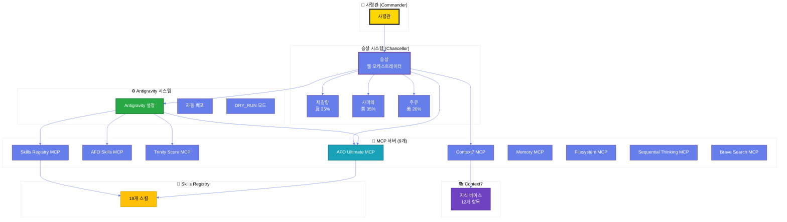
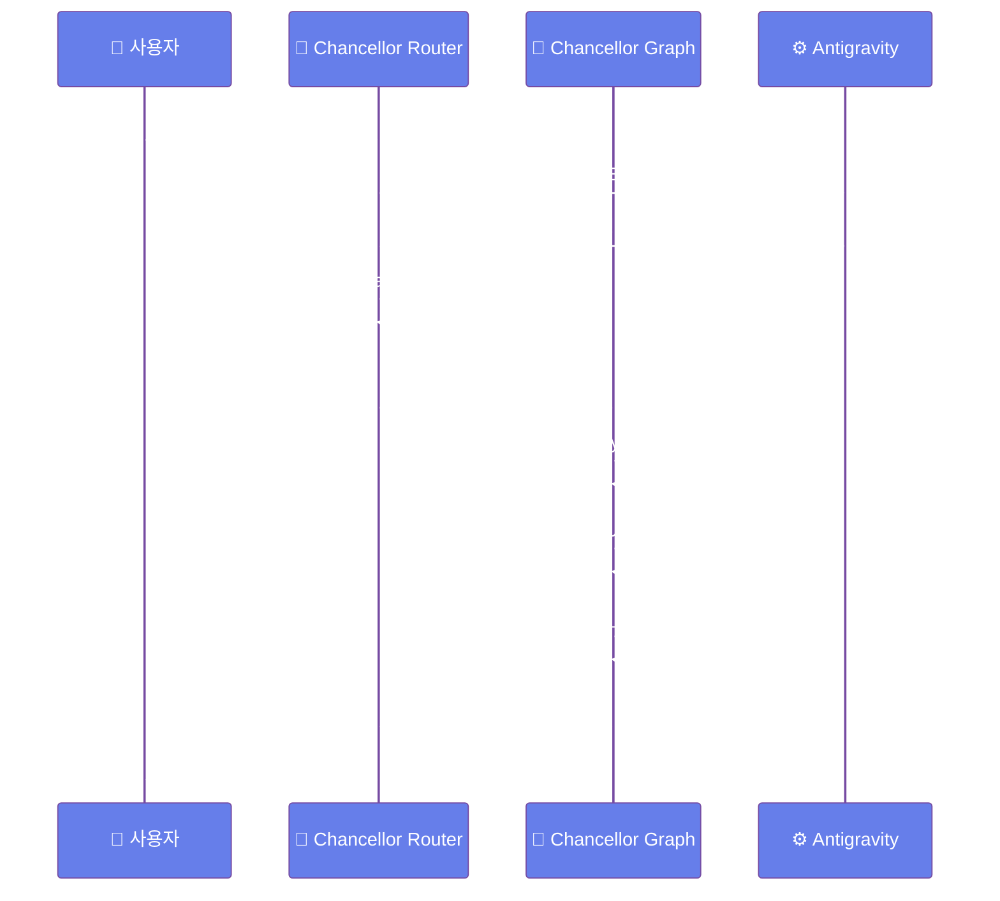
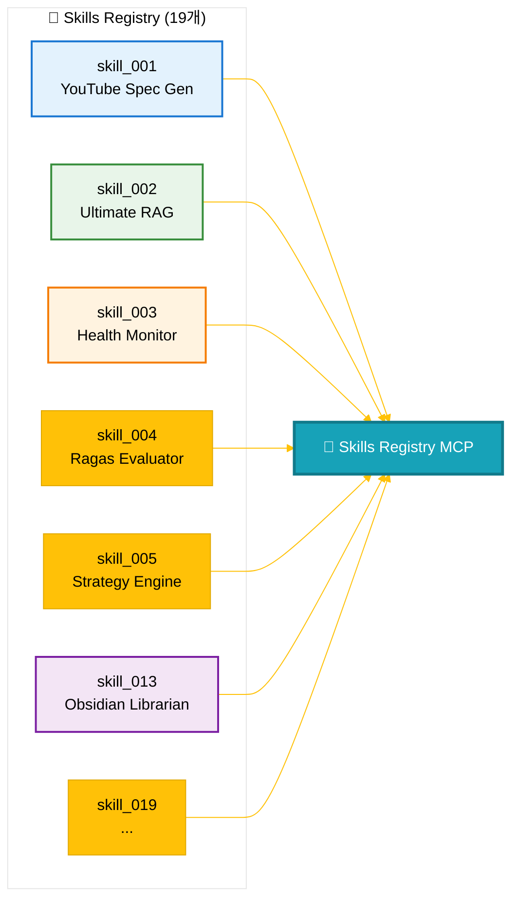
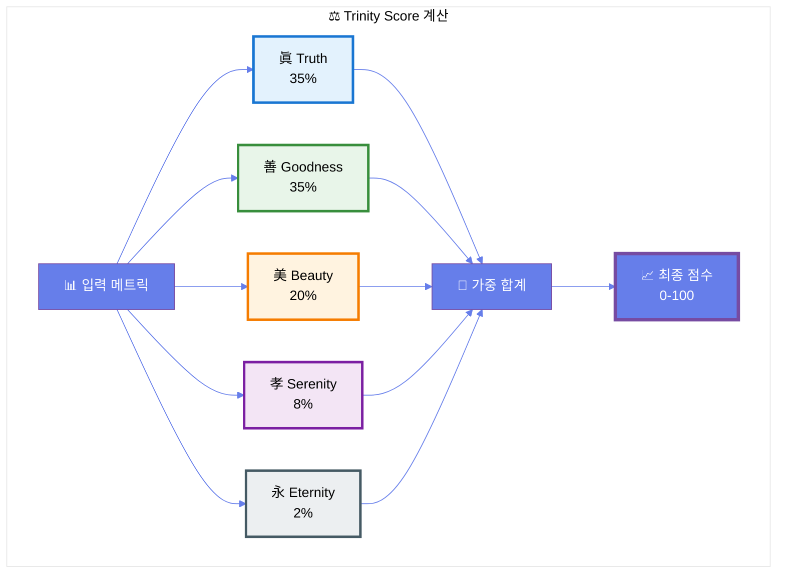
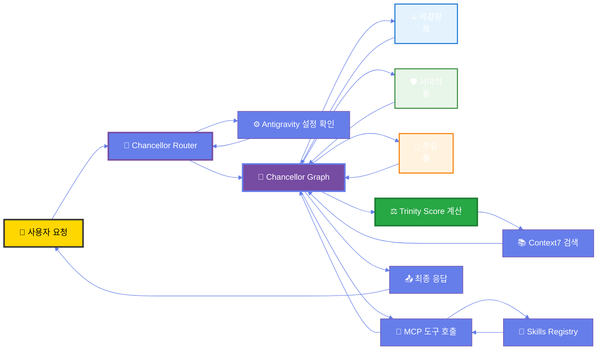

# 👑 AFO Kingdom - 왕국 대문

> **"지혜가 곧 코드이며, 철학이 곧 시스템이다."**

---

> [!abstract] 🏛️ 왕국 개요
> AFO Kingdom은 **眞善美孝永 5기둥 철학**을 기반으로 한 통합 AI 운영 체제입니다.
> 
> **핵심 철학**:
> - **眞 (Truth)**: 기술적 확실성 - Context7 기반 지식 주입
> - **善 (Goodness)**: 윤리·안정성 - Trinity Score 기반 가드레일
> - **美 (Beauty)**: 단순함·우아함 - Family Hub Dashboard
> - **孝 (Serenity)**: 평온·연속성 - Antigravity 자동화
> - **永 (Eternity)**: 영속성 - Next.js + FastAPI 확장 가능 아키텍처

---

---

## 📊 시스템 시각화

> [!tip] 💡 옵시디언 최적화 팁
> - Mermaid 다이어그램은 옵시디언에서 자동으로 렌더링됩니다
> - 다이어그램을 클릭하면 확대/축소 가능합니다
> - 전체 HTML 시각화는 [여기](./system_visualization.html)에서 확인하세요

### 🏛️ 시스템 아키텍처

### ⚙️ Antigravity & Chancellor 통합 흐름

### 🎯 Skills Registry 구조

### ⚖️ Trinity Score 시스템 (眞善美孝永)

### 🔄 데이터 흐름

---

## 🎨 옵시디언 2025년 최신 기능 활용

> [!tip] 💡 2025년 12월 최신 기능
> 
> 이 문서는 옵시디언의 **2025년 최신 기능**을 활용하여 작성되었습니다:
> 
> 1. **Callout Blocks** - 정보를 색상으로 구분하여 표시
> 2. **Mermaid 다이어그램** - 테마 커스터마이징으로 일관된 스타일
> 3. **표 형식 통계** - 마크다운 테이블로 데이터 시각화
> 4. **이모지 카테고리화** - 시각적 구분 강화

---

## 🎨 시각화 옵션

### 옵시디언 플러그인 추천 (2025년 12월 기준)

> [!example] 선택적 플러그인
> 
> 옵시디언은 **Mermaid를 기본 지원**하므로 플러그인 없이도 모든 다이어그램이 작동합니다.
> 
> **추천 플러그인** (향상된 경험):
> 1. **Mermaid Tools** - 다이어그램 편집 강화
> 2. **Advanced Tables** - 표 편집 기능 강화
> 3. **Kanban** - 칸반 보드 지원
> 4. **Dataview** - 동적 테이블 및 목록 생성
> 5. **Calendar** - 일일 노트 관리
> 
> 설치: 옵시디언 설정 → 커뮤니티 플러그인 → 검색

> [!link] 전체 화면 보기
> - [🌐 시스템 시각화 페이지 (브라우저)](./system_visualization.html) - 인터랙티브 HTML 시각화

---

## 🗺️ 왕국 지도

### 핵심 시스템

> [!info] 1. 승상 시스템 (Chancellor)
> **위치**: `packages/afo-core/chancellor_graph.py`  
> **역할**: LangGraph 기반 3책사 오케스트레이션
> 
> **책사**:
> - ⚔️ 제갈량 (眞 35%): 아키텍처·전략
> - 🛡️ 사마의 (善 35%): 윤리·안정성
> - 🌉 주유 (美 20%): 서사·UX

> [!success] 2. Antigravity 시스템
> **위치**: `packages/afo-core/config/antigravity.py`  
> **역할**: 마찰 제거 및 자동화
> 
> **설정**:
> - `AUTO_DEPLOY`: 자동 배포 활성화 ✅
> - `DRY_RUN_DEFAULT`: 안전 우선 모드 ✅
> - `ENVIRONMENT`: 환경 설정 (dev)

> [!example] 3. MCP 서버
> **총 9개 서버** 등록됨
> 
> **AFO Kingdom 전용** (4개):
> - `afo-ultimate-mcp`: Universal connector
> - `afo-skills-mcp`: CuPy acceleration
> - `trinity-score-mcp`: Trinity Score 계산
> - `afo-skills-registry-mcp`: 19개 스킬 제공
> 
> **외부 서버** (5개):
> - `memory`, `filesystem`, `sequential-thinking`, `brave-search`, `context7`

> [!check] 4. Skills Registry
> **총 19개 스킬** 등록됨
> - 모든 스킬이 MCP 도구로 변환됨 ✅
> - Trinity Score 자동 계산 통합 ✅

> [!note] 5. Context7 지식 베이스
> **총 12개 항목** 저장됨
> - 옵시디언 시스템 통합 ✅
> - Royal Library (41가지 원칙) 포함 ✅

---

## 📚 주요 문서

### 철학 & 헌법

> [!bookmark] 핵심 문서
> - [📜 AFO 왕국의 사서 (Royal Library)](./AFO_ROYAL_LIBRARY.md) - 41가지 원칙
> - [⚖️ Trinity Score 시스템](./TRINITY_SCORE_SSOT_ALIGNMENT.md)

### 시스템 통합

> [!gear] 통합 문서
> - [🔧 MCP Ecosystem](./MCP_ECOSYSTEM_README.md)
> - [⚙️ Antigravity & Chancellor 통합](./ANTIGRAVITY_CHANCELLOR_SYNC_VERIFICATION.md)
> - [📊 Cursor MCP 설정](./CURSOR_MCP_SETUP_FINAL_VERIFICATION.md)

### API & Skills

> [!api] API 문서
> - [🌐 API 엔드포인트](./API_ENDPOINTS_REFERENCE.md) - **49개** 엔드포인트
> - [🎯 Skills Registry](./SKILLS_REGISTRY_REFERENCE.md) - **19개** 스킬

### 배포 & 설정

> [!rocket] 운영 문서
> - [🚀 배포 가이드](./DEPLOYMENT_GUIDE.md)
> - [⚙️ 설정 가이드](./CONFIGURATION_GUIDE.md)
> - [🔧 문제 해결](./TROUBLESHOOTING.md)

### 옵시디언 시스템

> [!note] 옵시디언 확장
> - [📋 템플릿 시스템](./_templates/README.md) - 8개 전문 템플릿
> - [✅ 템플릿 검증 보고서](./OBSIDIAN_TEMPLATE_SYSTEM_FINAL_VERIFICATION.md) - Trinity Score: 94/100 🌟
> - [🔧 Vault 설정 가이드](./OBSIDIAN_VAULT_SETUP.md)
> - [📊 확장 작업 상태](./OBSIDIAN_EXTENSION_STATUS.md)

---

## 🔗 빠른 링크

> [!link] 시스템 상태
> - [🌐 시스템 시각화](./system_visualization.html) - 인터랙티브 다이어그램
> - [⚙️ GitHub Actions](./GITHUB_ACTIONS_FINAL_VERIFICATION.md) - CI/CD 상태

> [!link] 통합 검증
> - [📚 Context7 통합](./CONTEXT7_LEGACY_INTEGRATION_COMPLETE.md)
> - [🎯 Skills Registry MCP](./SKILLS_REGISTRY_MCP_INTEGRATION.md)

---

## 📊 시스템 통계

> [!stats] 📈 실시간 통계
> 
> | 항목 | 수량 | 상태 |
> |------|------|------|
> | 🔧 MCP 서버 | **9개** | ✅ |
> | 🎯 Skills | **19개** | ✅ |
> | 📚 Context7 항목 | **12개** | ✅ |
> | 🌐 API 엔드포인트 | **49개** | ✅ |
> | 📋 옵시디언 템플릿 | **8개** | ✅ |
> | 🔌 옵시디언 플러그인 | **42개** | ✅ |
> | 🔄 동기화 완료도 | **100%** | ✅ |
> | ⚖️ Trinity Score | **96/100** 🌟 | ✅ |

---

## 🎯 최근 업데이트

> [!update] 2025-01-27 업데이트
> - ✅ Antigravity & Chancellor 완벽 동기화
> - ✅ Context7 레거시 자료 통합 완료
> - ✅ Skills Registry MCP 통합 완료
> - ✅ 시스템 시각화 HTML 생성
> - ✅ 옵시디언 최적화 완료
> - ✅ 옵시디언 확장 템플릿 시스템 완료 (Trinity Score: 96/100 🌟)
> - ✅ 교차검증 완료 - 모든 개선사항 적용 확인

---

> [!info] 문서 정보
> **생성일**: 2025-01-27  
> **담당**: 승상 (丞相) - AFO Kingdom  
> **상태**: 🟢 Operational (Harmony)  
> **버전**: 1.0.0  
> **Vault 위치**: `/Users/brnestrm/AFO_Kingdom/docs`  
> **검증**: [옵시디언 도서관 완벽 검증 보고서](./OBSIDIAN_LIBRARY_COMPLETE_VERIFICATION.md) ✅  
> **Vault 설정**: [옵시디언 Vault 설정 가이드](./OBSIDIAN_VAULT_SETUP.md) ✅  
> **확장 작업**: [옵시디언 확장 작업 상태](./OBSIDIAN_EXTENSION_STATUS.md) ✅  
> **템플릿**: [템플릿 가이드](./_templates/README.md) ✅  
> **템플릿 검증**: [템플릿 시스템 최종 검증](./OBSIDIAN_TEMPLATE_SYSTEM_FINAL_VERIFICATION.md) - Trinity Score: 96/100 🌟 ✅  
> **교차검증**: [교차검증 보고서](./OBSIDIAN_CROSS_VERIFICATION_REPORT.md) ✅

