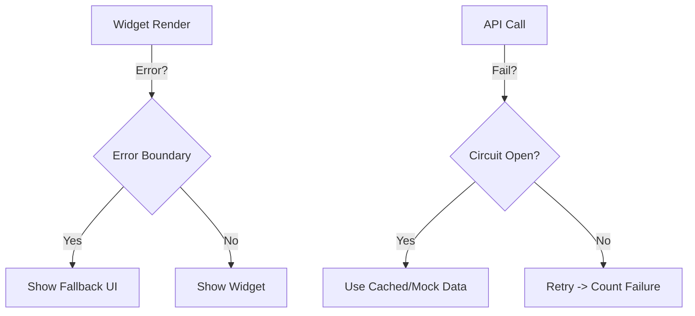

# AFO System Stabilization Strategy (Project Serenity) 🕊️
**Date**: 2025-12-21
**Objective**: Soothe the Royal Organs (Backend) and Optic Nerves (Frontend).

## 1. Frontend Stabilization (The Face)
*"The King's face must never show panic."*
- **Error Boundaries**: Implement a `<RoyalErrorBoundary>` around every widget. If a widget crashes, it gracefully shows a "Under Maintenance" card instead of white-screening the app.
- **Skeleton Loading**: Use `framer-motion` skeletons during data fetch to prevent layout shifts ("Jank").
- **Strict Typing**: Enforce `strict: true` in `tsconfig.json` to prevent runtime `undefined` errors.

## 2. Backend Stabilization (The Organs)
*"The Heart must beat rhythmically."*
- **Circuit Breakers**: If an external API (LLM) fails 3 times, switch to "Local Mode" for 5 minutes.
- **Health Heartbeat**: A background thread (`SimaYi_Pulse`) that checks DB/Redis/LLM connectivity every 10s and updates `SSOT`.

## 3. Visual Integrity (The Eyes)
- **AutoRecon**: Run `auto_recon.py` every hour.
- **Pixel Regression**: Compare screenshots against specific "Golden Masters" to detect unauthorized UI changes.

## 🚦 Stabilization Action Plan
| Priority | Task | Pillar |
|---|---|---|
| 🚨 High | **Fix Dashboard Layout** | Beauty (Done) |
| 🔴 High | **Add Error Boundaries** | Goodness |
| 🟡 Med | **Implement Circuit Breakers** | Serenity |
| 🟢 Low | **Visual Regression Tests** | Truth |

