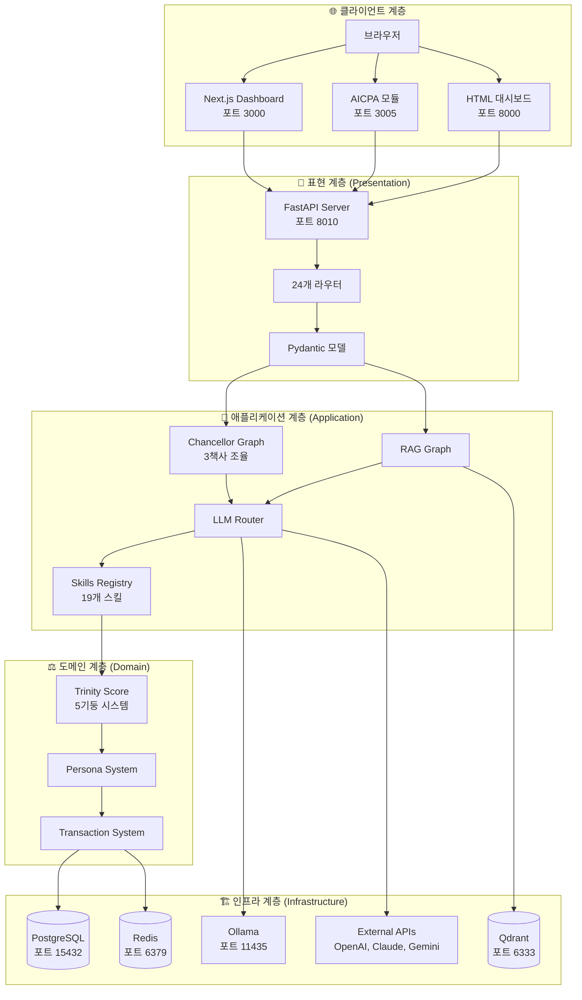
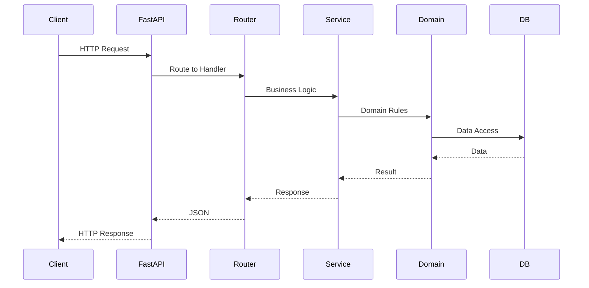
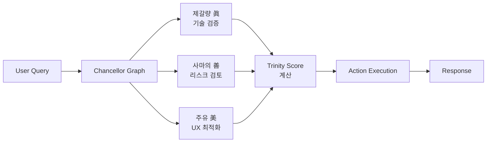
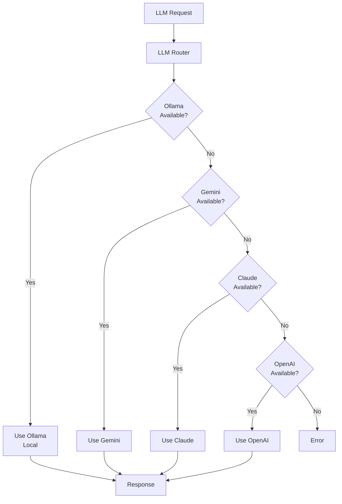
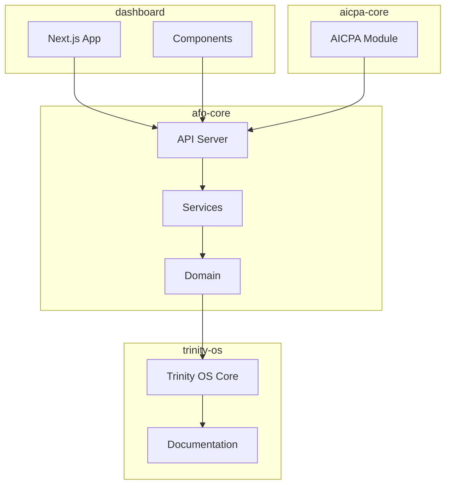

# AFO Kingdom 아키텍처 지도

> **眞善美孝永** - AFO Kingdom 전체 아키텍처 시각화 지도  
> **작성일**: 2025-12-22  
> **목적**: 시스템 전체 구조를 한눈에 파악할 수 있는 지도

---

## 🗺️ 전체 아키텍처 개요

---

## 🔄 데이터 흐름 상세

### 1. API 요청 흐름

### 2. Chancellor Graph 흐름

### 3. LLM Router 흐름

---

## 📦 패키지 간 의존성

---

## 🏛️ 시스템 구성 요소

### 1. 표현 계층 (Presentation Layer)

#### FastAPI 서버
- **파일**: `packages/afo-core/api_server.py`
- **포트**: 8010
- **기능**: 
  - RESTful API 엔드포인트
  - OpenAPI 문서 자동 생성
  - CORS, 로깅 미들웨어

#### 라우터 시스템
- **24개 라우터**: `packages/afo-core/api/routers/`
- **23개 라우트**: `packages/afo-core/api/routes/`
- **등록**: `packages/afo-core/api/routers.py`

#### Pydantic 모델
- **5개 모델**: `packages/afo-core/api/models/`
- **타입 안전성**: 완전한 타입 검증

---

### 2. 애플리케이션 계층 (Application Layer)

#### Chancellor Graph
- **파일**: `packages/afo-core/chancellor_graph.py`
- **기술**: LangGraph
- **기능**: 
  - 3책사 병렬 조율
  - Trinity Score 기반 라우팅
  - 의사결정 엔진

#### RAG Graph
- **파일**: `packages/afo-core/scripts/rag/rag_graph.py`
- **기능**: 
  - HyDE (Hypothetical Document Embeddings)
  - Hybrid Retrieval
  - Graph Expansion
  - Rerank
  - Generation

#### LLM Router
- **파일**: `packages/afo-core/llm_router.py`
- **폴백 순서**: Ollama → Gemini → Claude → OpenAI
- **최적화**: 비용 최적화, 로컬 우선

#### Skills Registry
- **파일**: `packages/afo-core/AFO/afo_skills_registry.py`
- **스킬 수**: 19개
- **통합**: MCP 도구와 통합

---

### 3. 도메인 계층 (Domain Layer)

#### Trinity Score 시스템
- **파일**: `packages/afo-core/domain/metrics/trinity.py`
- **가중치**:
  - 眞 (Truth): 35%
  - 善 (Goodness): 35%
  - 美 (Beauty): 20%
  - 孝 (Serenity): 8%
  - 永 (Eternity): 2%

#### Persona System
- **파일**: `packages/afo-core/domain/persona.py`
- **기능**: 페르소나 관리

#### Transaction System
- **파일**: `packages/afo-core/domain/transaction.py`
- **기능**: 트랜잭션 관리

---

### 4. 인프라 계층 (Infrastructure Layer)

#### 데이터베이스
- **PostgreSQL**: 
  - 포트: 15432
  - 용도: 장기 기억
  - 연결: `packages/afo-core/services/database.py`

#### 캐시
- **Redis**: 
  - 포트: 6379
  - 용도: 실시간 캐시
  - 연결: `packages/afo-core/utils/redis_connection.py`

#### 벡터 검색
- **Qdrant**: 
  - 포트: 6333
  - 용도: 벡터 검색
  - 연결: 직접 `QdrantClient` 사용

#### LLM 서비스
- **Ollama**: 로컬 LLM (포트 11435)
- **External APIs**: OpenAI, Anthropic, Google Gemini

---

## 🔌 통합 포인트

### API 엔드포인트
- **Base URL**: `http://localhost:8010`
- **OpenAPI Docs**: `http://localhost:8010/docs`
- **Health Check**: `http://localhost:8010/health`

### 포트 매핑
| 서비스 | 포트 | 프로토콜 | 설명 |
|--------|------|----------|------|
| API Server | 8010 | HTTP | FastAPI 백엔드 |
| Dashboard | 3000 | HTTP | Next.js 프론트엔드 |
| AICPA | 3005 | HTTP | AICPA 모듈 |
| HTML Server | 8000 | HTTP | kingdom_dashboard.html |
| PostgreSQL | 15432 | TCP | 데이터베이스 |
| Redis | 6379 | TCP | 캐시 |
| Qdrant | 6333 | HTTP | 벡터 검색 |
| Ollama | 11435 | HTTP | 로컬 LLM |

---

## 🎯 아키텍처 원칙

### 1. 계층 분리
- **명확한 책임**: 각 계층은 명확한 책임을 가짐
- **의존성 방향**: 상위 계층만 하위 계층에 의존
- **인터페이스**: 계층 간 인터페이스로 결합도 최소화

### 2. 모듈화
- **독립성**: 각 모듈은 독립적으로 동작 가능
- **재사용성**: 모듈 간 재사용 가능
- **테스트 용이성**: 각 모듈을 독립적으로 테스트 가능

### 3. 확장성
- **수평 확장**: 서비스 단위로 확장 가능
- **수직 확장**: 계층별로 확장 가능
- **플러그인**: 새로운 기능을 플러그인으로 추가

### 4. 안정성
- **에러 핸들링**: 포괄적 예외 처리
- **폴백 메커니즘**: 실패 시 대체 경로 제공
- **모니터링**: 실시간 모니터링 및 알림

---

## 📊 성능 최적화

### 1. 캐싱 전략
- **Redis**: 실시간 데이터 캐싱
- **SWR**: 프론트엔드 데이터 캐싱
- **CDN**: 정적 파일 캐싱

### 2. 비동기 처리
- **FastAPI**: 비동기 요청 처리
- **LangGraph**: 비동기 그래프 실행
- **Background Tasks**: 백그라운드 작업

### 3. 데이터베이스 최적화
- **인덱싱**: 적절한 인덱스 설정
- **쿼리 최적화**: 효율적인 쿼리 작성
- **연결 풀링**: 데이터베이스 연결 풀 관리

---

## 🔒 보안 아키텍처

### 1. 인증/인가
- **API Key**: API 키 기반 인증
- **JWT**: 토큰 기반 인증 (필요 시)
- **Role-based**: 역할 기반 접근 제어

### 2. 데이터 보안
- **암호화**: 민감 데이터 암호화
- **API Wallet**: 키 관리 시스템
- **보안 스캔**: Trivy, Snyk 통합

### 3. 인프라 보안
- **CIS Benchmark**: Level 2 달성
- **Docker Hardening**: 컨테이너 보안 강화
- **Kubernetes Security**: K8s 보안 설정

---

## 📝 결론

AFO Kingdom은 **4계층 아키텍처**를 기반으로 한 완전한 시스템입니다.

**핵심 특징**:
1. **명확한 계층 분리**: Presentation → Application → Domain → Infrastructure
2. **모듈화**: 독립적이면서도 통합된 모듈 구조
3. **확장성**: 수평/수직 확장 가능한 구조
4. **안정성**: 포괄적 에러 핸들링 및 폴백 메커니즘
5. **보안**: CIS Benchmark Level 2 달성

**이 지도는 왕국의 전체 구조를 한눈에 보여줍니다.** 🏰

---

*작성 완료일: 2025-12-22*  
*작성자: AFO Kingdom Chancellor System*

