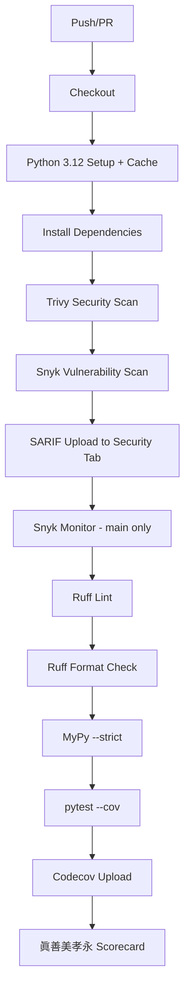

# AFO Kingdom CI/CD Pipeline

## 眞善美孝永 자동화 철학

| 기둥 | CI/CD 적용 |
|------|-----------|
| 眞 (Truth) | MyPy 타입 검사, pytest 커버리지 |
| 善 (Goodness) | Trivy 보안 스캔, DRY_RUN 테스트 |
| 美 (Beauty) | Ruff lint/format 자동화 |
| 孝 (Serenity) | 캐싱, 빠른 피드백, 자동화 |
| 永 (Eternity) | Codecov 추적, Dependabot 업데이트 |

---

## 워크플로우 구조

### `.github/workflows/ci.yml`



---

## 보안 자동화

### Trivy Scanner

- **취약점**: Python dependencies 스캔
- **시크릿**: 하드코딩된 API 키 탐지
- **설정 오류**: Dockerfile, YAML 검사
- **SARIF**: GitHub Security tab 자동 표시

### Snyk Scanner

- **취약점**: Python/pip 의존성 스캔
- **자동 Fix PR**: 취약 버전 → 안전 버전 업그레이드
- **Monitor**: main 브랜치 지속 모니터링
- **Severity Filter**: High 이상만 알림
- **SARIF**: GitHub Security tab 통합

### Dependabot

- **pip**: 주간 월요일 09:00 KST
- **GitHub Actions**: 주간 업데이트
- **npm**: trinity-dashboard 주간 업데이트

---

## 품질 자동화

### 린팅
```bash
ruff check .          # 린트 오류
ruff format --check . # 포맷 검사
```

### 타입 검사
```bash
mypy AFO/ --strict
```

### 테스트 + 커버리지
```bash
ENV=test pytest --cov=AFO --cov-report=xml
```

### 眞善美孝永 스코어
```bash
python scripts/automate_scorecard.py AFO/
```

---

## 사용 방법

### 로컬 테스트
```bash
# 전체 CI 시뮬레이션
pip install ruff mypy pytest pytest-cov
ruff check . && ruff format --check .
mypy AFO/ --strict
ENV=test pytest --cov=AFO
python scripts/automate_scorecard.py AFO/
```

### PR 생성 시
1. Push → CI 자동 실행
2. Trivy 스캔 결과 → Security tab 확인
3. 테스트 통과 → 머지 가능

---

## 파일 목록

| 파일 | 설명 |
|------|------|
| `.github/workflows/ci.yml` | 메인 CI 워크플로우 |
| `.github/dependabot.yml` | 자동 보안 업데이트 |
| `SECURITY.md` | 보안 정책 |
| `scripts/automate_scorecard.py` | 眞善美孝永 자동 스코어링 |
