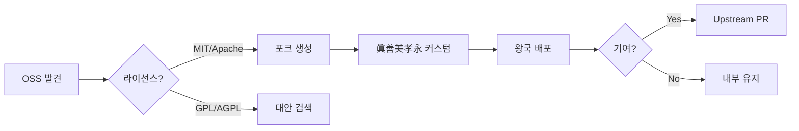

# AFO Kingdom 오픈소스 전략

## 세종대왕 정신 (世宗大王 精神)

> "기존 오픈소스를 찾아 → 왕국 커스텀으로 확장·고쳐쓰기"

### 핵심 원칙

| 원칙 | 세종대왕 | AFO Kingdom |
|------|----------|-------------|
| **실용 흡수** | 한자·중국 기술 활용 | 기존 OSS 포크 |
| **왕국 커스텀** | 훈민정음·측우기 창제 | 眞善美孝永 철학 주입 |
| **문화 주권** | 조선 독자 문자·과학 | MIT/Apache 선택 |
| **기여 환원** | 백성 교육·보급 | Upstream PR |

---

## 세종대왕 사례 → OSS 매핑

| 세종대왕 사례 | 기존 기술 흡수 | 조선 커스텀 | AFO Kingdom 적용 |
|--------------|---------------|------------|-----------------|
| **훈민정음** | 한자·몽골 문자 | 28자 음소 문자 창제 | FastAPI → 眞善美 API |
| **측우기** | 중국 측우법 | 청동 정밀 측우기 | Trivy → Trinity Score |
| **앙부일구** | 이슬람 천문 | 해시계 독자 제작 | SigNoz → 오장육부 메트릭 |
| **농사직설** | 중국 농서 | 조선 기후 맞춤 지침 | LangGraph → Chancellor |
| **용비어천가** | 고려 시가 형식 | 건국 정당성 노래 | OpenWebUI → 왕국 철학 UI |
| **집현전** | 서역 서적 수입 | 번역·편찬·연구 | 전체 스택 → 왕국 R&D |

---

## 라이선스 우선순위

1. **MIT** (최우선) - 최대 자유
2. **Apache 2.0** - 특허 보호
3. **BSD** - MIT와 유사

### ⚠️ 피해야 할 라이선스

- **AGPL** - SaaS 모델 위험
- **GPL** - 상업 제한

---

## 추천 OSS 포크 대상

| 영역 | OSS | 라이선스 | 세종대왕식 커스텀 |
|------|-----|----------|------------------|
| API | FastAPI | MIT | 훈민정음 = 眞善美 라우터 |
| 모니터링 | SigNoz | Apache | 앙부일구 = 오장육부 대시보드 |
| 보안 | Trivy | Apache | 측우기 = Trinity Score 연동 |
| RAG | LlamaIndex | MIT | 농사직설 = 5기둥 평가 |
| Agent | LangGraph | MIT | 집현전 = Chancellor Graph |
| UI | OpenWebUI | MIT | 용비어천가 = 왕국 철학 UI |

---

## 포크 워크플로우

---

## 眞善美孝永 연계

| 기둥 | OSS 전략 | 세종대왕 정신 |
|------|---------|--------------|
| 眞 | 라이선스 투명 | 진실된 흡수 |
| 善 | 커뮤니티 기여 | 백성 실용 |
| 美 | 우아한 커스텀 | 간결한 창제 |
| 孝 | 안정적 포크 | 평온한 보급 |
| 永 | 장기 관계 | 영원한 유산 |

