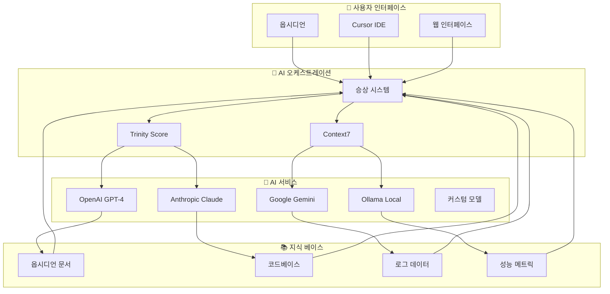
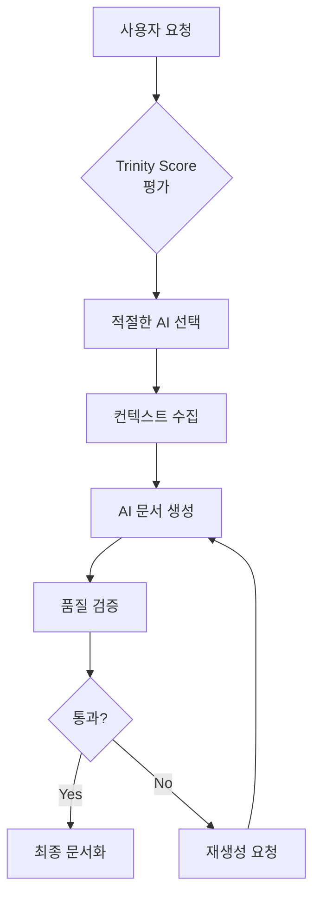
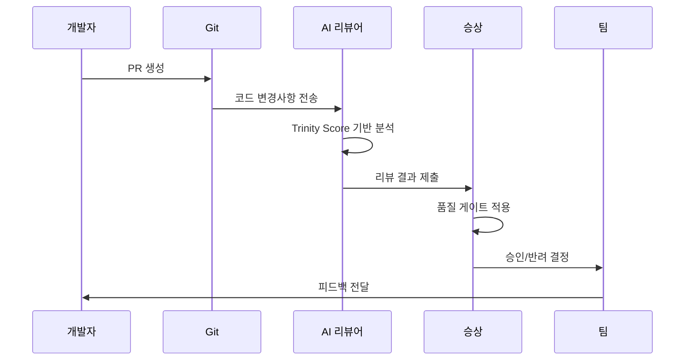
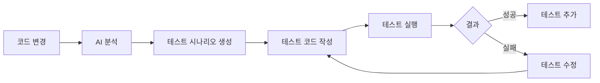

# AI 통합 가이드

> [!abstract] AI 통합 개요
> AFO Kingdom의 AI 기반 자동화 및 지능화 시스템입니다.
> 옵시디언과 외부 AI 서비스의 통합을 통해 생산성을 극대화합니다.

---

## 🤖 AI 통합 아키텍처

### AI 서비스 레이어



### AI 에이전트 역할 분담

| AI 에이전트 | 역할 | 담당 영역 | Trinity Score |
|------------|------|----------|--------------|
| **GPT-4** | 창의적 문제 해결 | 아키텍처 설계, 전략 수립 | 眞 35% |
| **Claude** | 논리적 분석 | 코드 리뷰, 디버깅 | 善 35% |
| **Gemini** | 데이터 처리 | 메트릭 분석, 패턴 인식 | 美 20% |
| **Ollama** | 로컬 처리 | 보안 검토, 개인화 | 孝 8% + 永 2% |

---

## 🚀 AI 자동화 워크플로우

### 1. 문서 생성 자동화

#### AI 기반 문서 생성 플로우



#### 자동 문서 생성 예제

```javascript
// 문서 자동 생성 함수
async function generateDocument(type, context) {
    const trinityScore = await calculateTrinityScore(context);

    let aiModel;
    if (trinityScore.truth > 0.8) {
        aiModel = 'gpt-4'; // 아키텍처 설계
    } else if (trinityScore.goodness > 0.8) {
        aiModel = 'claude'; // 코드 리뷰
    } else if (trinityScore.beauty > 0.8) {
        aiModel = 'gemini'; // UX 개선
    } else {
        aiModel = 'ollama'; // 일반 문서
    }

    const prompt = buildPrompt(type, context, trinityScore);
    const response = await callAIModel(aiModel, prompt);

    return await validateAndFormat(response);
}
```

### 2. 코드 리뷰 자동화

#### AI 코드 리뷰 파이프라인



#### 자동 코드 리뷰 설정

```yaml
# .github/workflows/ai-code-review.yml
name: AI Code Review

on:
  pull_request:
    types: [opened, synchronize, reopened]

jobs:
  ai-review:
    runs-on: ubuntu-latest
    steps:
      - name: Checkout code
        uses: actions/checkout@v4

      - name: Setup Python
        uses: actions/setup-python@v4
        with:
          python-version: '3.12'

      - name: AI Code Review
        run: |
          python scripts/ai_code_review.py \
            --pr-number ${{ github.event.pull_request.number }} \
            --trinity-threshold 85

      - name: Post Review Comments
        uses: actions/github-script@v7
        with:
          script: |
            const review = require('./ai-review-results.json');
            await github.rest.pulls.createReview({
              owner: context.repo.owner,
              repo: context.repo.repo,
              pull_number: context.issue.number,
              body: review.summary,
              event: review.approved ? 'APPROVE' : 'REQUEST_CHANGES',
              comments: review.comments
            });
```

### 3. 테스트 자동 생성

#### AI 테스트 생성 시스템



#### 자동 테스트 생성 스크립트

```python
# scripts/generate_ai_tests.py
import openai
import ast
import pytest

def generate_ai_tests(code_file, context):
    """AI를 활용한 자동 테스트 생성"""

    # 코드 분석
    with open(code_file, 'r') as f:
        code = f.read()

    tree = ast.parse(code)
    functions = [node.name for node in ast.walk(tree) if isinstance(node, ast.FunctionDef)]

    # AI 프롬프트 생성
    prompt = f"""
다음 Python 함수들에 대한 포괄적인 단위 테스트를 생성해주세요:

함수 목록: {', '.join(functions)}

코드:
{code}

요구사항:
1. pytest 프레임워크 사용
2. 모든 edge case 포함
3. mocking을 적절히 활용
4. 명확한 assertion 사용
5. 테스트 커버리지 90% 이상 목표

Trinity Score 기반 접근:
- Truth: 정확한 테스트 로직
- Goodness: robust한 에러 처리
- Beauty: 가독성 높은 코드
"""

    # AI 호출
    response = openai.ChatCompletion.create(
        model="gpt-4",
        messages=[{"role": "user", "content": prompt}],
        temperature=0.3
    )

    test_code = response.choices[0].message.content

    # 테스트 파일 생성
    test_file = f"tests/test_{code_file.stem}_ai.py"
    with open(test_file, 'w') as f:
        f.write(test_code)

    return test_file
```

---

## 🎨 AI 지원 문서화

### 1. 자동 요약 생성

#### 문서 요약 AI 파이프라인

```dataviewjs
const pages = dv.pages('"docs"').where(p => p.file.size > 5000); // 5KB 이상 문서

for (const page of pages) {
    if (!page.summary || page.mtime > page.summary_updated) {
        // AI 요약 생성 요청
        const summary = await generateAISummary(page.file.path);
        dv.paragraph(`**AI 생성 요약**: ${summary}`);
    }
}
```

#### 요약 생성 함수

```javascript
async function generateAISummary(filePath) {
    const content = await dv.io.load(filePath);
    const trinityScore = await calculateDocumentTrinity(content);

    const prompt = `다음 문서를 3줄로 요약해주세요. Trinity Score (${trinityScore.toFixed(1)})을 고려하여 중요한 부분을 강조하세요:\n\n${content.substring(0, 2000)}`;

    const response = await callAIModel('gemini', prompt, {
        temperature: 0.3,
        maxTokens: 200
    });

    return response.trim();
}
```

### 2. 콘텐츠 추천 시스템

#### AI 기반 관련 문서 추천

```dataviewjs
const currentPage = dv.current();
const allPages = dv.pages('"docs"').where(p => p.file.path !== currentPage.file.path);

const recommendations = await getContentRecommendations(currentPage, allPages);

dv.header(3, "🤖 AI 추천 문서");
for (const rec of recommendations.slice(0, 5)) {
    dv.paragraph(`- [[${rec.file.name}]] (유사도: ${(rec.similarity * 100).toFixed(1)}%)`);
}
```

### 3. 다이어그램 자동 생성

#### Mermaid 다이어그램 AI 생성

```javascript
async function generateMermaidDiagram(description, diagramType = 'graph') {
    const prompt = `다음 설명을 바탕으로 ${diagramType} 타입의 Mermaid 다이어그램 코드를 생성해주세요:

설명: ${description}

요구사항:
- AFO Kingdom 색상 테마 적용 (#667eea, #764ba2)
- 한국어 레이블 사용
- 명확한 구조와 관계 표현
- Trinity Score 기반 디자인 (眞善美)
`;

    const response = await callAIModel('claude', prompt, {
        temperature: 0.7,
        maxTokens: 500
    });

    // Mermaid 코드 검증 및 정리
    return cleanMermaidCode(response);
}
```

---

## 📊 AI 메트릭 및 모니터링

### AI 성능 대시보드

```dataviewjs
const aiMetrics = await getAIMetrics();

dv.header(2, "📊 AI 성능 메트릭");

const metricsTable = [
    ['모델', '응답 시간', '정확도', '사용 빈도'],
    ['GPT-4', `${aiMetrics.gpt4.avgResponseTime}ms`, `${(aiMetrics.gpt4.accuracy * 100).toFixed(1)}%`, aiMetrics.gpt4.usageCount],
    ['Claude', `${aiMetrics.claude.avgResponseTime}ms`, `${(aiMetrics.claude.accuracy * 100).toFixed(1)}%`, aiMetrics.claude.usageCount],
    ['Gemini', `${aiMetrics.gemini.avgResponseTime}ms`, `${(aiMetrics.gemini.accuracy * 100).toFixed(1)}%`, aiMetrics.gemini.usageCount],
    ['Ollama', `${aiMetrics.ollama.avgResponseTime}ms`, `${(aiMetrics.ollama.accuracy * 100).toFixed(1)}%`, aiMetrics.ollama.usageCount]
];

dv.table(metricsTable[0], metricsTable.slice(1));
```

### AI 비용 및 효율성 분석

```dataviewjs
const costAnalysis = await analyzeAICosts();

dv.header(3, "💰 AI 비용 분석");
dv.paragraph(`**월간 총 비용**: $${costAnalysis.monthlyTotal.toFixed(2)}`);
dv.paragraph(`**토큰당 비용**: $${costAnalysis.costPerToken.toFixed(4)}`);
dv.paragraph(`**가성비 점수**: ${costAnalysis.efficiencyScore.toFixed(1)}/100`);

const costBreakdown = Object.entries(costAnalysis.byModel).map(([model, cost]) =>
    `${model}: $${cost.toFixed(2)}`
).join(', ');

dv.paragraph(`**모델별 비용**: ${costBreakdown}`);
```

### AI 품질 메트릭

```dataviewjs
const qualityMetrics = await getAIQualityMetrics();

dv.header(3, "🎯 AI 품질 메트릭");

// Trinity Score 기반 품질 평가
const trinityQuality = {
    truth: qualityMetrics.averageTruthScore,
    goodness: qualityMetrics.averageGoodnessScore,
    beauty: qualityMetrics.averageBeautyScore
};

dv.paragraph(`**평균 Trinity Score**: 眞${trinityQuality.truth.toFixed(1)} 善${trinityQuality.goodness.toFixed(1)} 美${trinityQuality.beauty.toFixed(1)}`);

// 품질 추이 차트
const qualityTrend = qualityMetrics.qualityTrend.map(item =>
    `${item.date}: ${item.score.toFixed(1)}`
).join(' → ');

dv.paragraph(`**품질 추이**: ${qualityTrend}`);
```

---

## 🔧 AI 통합 설정

### 환경 변수 설정

```bash
# .env 파일
# OpenAI
OPENAI_API_KEY=sk-your-openai-key
OPENAI_MODEL=gpt-4-turbo-preview

# Anthropic Claude
ANTHROPIC_API_KEY=sk-ant-your-claude-key
ANTHROPIC_MODEL=claude-3-opus-20240229

# Google Gemini
GOOGLE_API_KEY=your-gemini-api-key
GOOGLE_MODEL=gemini-pro

# Ollama (로컬)
OLLAMA_BASE_URL=http://localhost:11434
OLLAMA_MODEL=llama2:13b

# AI 설정
AI_TEMPERATURE=0.7
AI_MAX_TOKENS=4000
AI_TRINITY_THRESHOLD=85
```

### 옵시디언 AI 플러그인 설정

```json
{
  "ai-integration": {
    "enabled": true,
    "defaultModel": "claude",
    "trinityRouting": true,
    "autoComplete": true,
    "contextAware": true,
    "costTracking": true,
    "qualityMonitoring": true
  }
}
```

### Cursor AI 설정

```json
{
  "ai": {
    "provider": "trinity-router",
    "models": {
      "primary": "claude",
      "secondary": "gpt-4",
      "tertiary": "gemini",
      "fallback": "ollama"
    },
    "routing": {
      "enabled": true,
      "trinityThreshold": 85,
      "costOptimization": true
    }
  }
}
```

---

## 🚀 고급 AI 패턴

### 1. 멀티모달 AI 처리

#### 이미지 분석 및 문서화

```python
# scripts/ai_image_analysis.py
import base64
from openai import OpenAI

def analyze_architecture_diagram(image_path):
    """아키텍처 다이어그램 이미지 분석"""

    with open(image_path, "rb") as image_file:
        base64_image = base64.b64encode(image_file.read()).decode('utf-8')

    client = OpenAI()
    response = client.chat.completions.create(
        model="gpt-4-vision-preview",
        messages=[{
            "role": "user",
            "content": [
                {"type": "text", "text": "이 아키텍처 다이어그램을 분석하여 Mermaid 코드로 변환해주세요."},
                {"type": "image_url", "image_url": {"url": f"data:image/png;base64,{base64_image}"}}
            ]
        }],
        max_tokens=1000
    )

    return response.choices[0].message.content
```

### 2. AI 기반 코드 리팩토링

#### 자동 리팩토링 제안

```python
# scripts/ai_code_refactor.py
def suggest_refactoring(code_file):
    """AI 기반 코드 리팩토링 제안"""

    with open(code_file, 'r') as f:
        code = f.read()

    prompt = f"""
다음 Python 코드를 분석하여 리팩토링 제안을 해주세요:

```python
{code}
```

Trinity Score 기반 접근:
- 眞 (Truth): 코드 구조 및 알고리즘 개선
- 善 (Goodness): 에러 처리 및 안정성 향상
- 美 (Beauty): 가독성 및 유지보수성 개선

구체적인 제안사항:
1. 함수 분리 및 모듈화
2. 디자인 패턴 적용
3. 성능 최적화
4. 테스트 용이성 개선
"""

    response = call_ai_model('claude', prompt)
    return parse_refactoring_suggestions(response)
```

### 3. AI 협업 증강

#### 실시간 페어 프로그래밍

```javascript
// AI 페어 프로그래밍 지원
class AIPairProgrammer {
    constructor(model = 'claude') {
        this.model = model;
        this.context = [];
    }

    async suggestImprovement(code, cursorPosition) {
        const context = this.getContextAroundCursor(code, cursorPosition);

        const prompt = `다음 코드 컨텍스트에서 개선점을 제안해주세요:

코드:
${context.beforeCursor}
[커서 위치]
${context.afterCursor}

제안사항:
- 코드 완성
- 버그 수정
- 성능 개선
- 모범 사례 적용
`;

        return await this.callAI(prompt);
    }

    async explainCode(code) {
        const prompt = `다음 코드를 설명해주세요:

${code}

설명 포맷:
1. 목적과 기능
2. 주요 알고리즘
3. 잠재적 문제점
4. 개선 제안
`;

        return await this.callAI(prompt);
    }
}
```

---

## 📈 AI 발전 로드맵

### Phase 1: 기본 통합 (현재)
- ✅ Trinity Score 기반 AI 라우팅
- ✅ 기본 코드 리뷰 자동화
- ✅ 문서 자동 생성
- ✅ Dataview AI 쿼리

### Phase 2: 고도화 (다음 목표)
- 🔄 실시간 협업 AI
- 🔄 멀티모달 입력 처리
- 🔄 AI 기반 테스트 생성
- 🔄 코드 자동 리팩토링

### Phase 3: 자율성 (장기 비전)
- 🤖 완전 자동화된 개발 파이프라인
- 🤖 AI 기반 아키텍처 설계
- 🤖 자가 학습 및 개선
- 🤖 인간-AI 협업 최적화

---

## ⚠️ AI 사용 가이드라인

### 윤리적 고려사항

#### 데이터 프라이버시
- **민감 데이터 처리**: AI 모델에 민감 정보 노출 금지
- **로컬 처리 우선**: 가능한 경우 Ollama 같은 로컬 모델 사용
- **데이터 최소화**: AI 호출 시 필요한 최소 데이터만 전송

#### 품질 관리
- **Trinity Score 임계값**: 85점 이상 AI 결과만 사용
- **인간 검토**: 중요한 결정은 AI 추천 후 인간 검토
- **오류 처리**: AI 실패 시 적절한 폴백 메커니즘

#### 투명성
- **AI 생성 콘텐츠 표시**: AI 생성 문서는 명확히 표시
- **출처 추적**: AI 응답의 출처 모델 및 버전 기록
- **편향성 모니터링**: AI 응답의 편향성 정기 검토

---

## 🔍 AI 디버깅 및 모니터링

### AI 응답 로깅

```python
# scripts/ai_monitoring.py
import logging
from datetime import datetime

class AIMonitoring:
    def __init__(self):
        self.logger = logging.getLogger('ai_monitoring')

    def log_ai_interaction(self, model, prompt, response, trinity_score, execution_time):
        """AI 상호작용 로깅"""

        log_entry = {
            'timestamp': datetime.now().isoformat(),
            'model': model,
            'prompt_length': len(prompt),
            'response_length': len(response),
            'trinity_score': trinity_score,
            'execution_time': execution_time,
            'success': trinity_score >= 85
        }

        self.logger.info(f"AI Interaction: {log_entry}")

        # 메트릭 업데이트
        self.update_metrics(log_entry)

    def update_metrics(self, log_entry):
        """AI 메트릭 업데이트"""
        # Prometheus 메트릭 등에 반영
        pass
```

### AI 성능 분석

```dataviewjs
const aiLogs = dv.pages('"logs"').where(p => p.type === "ai-interaction");

const performanceData = {
    totalInteractions: aiLogs.length,
    averageTrinityScore: aiLogs.avg(p => p.trinity_score),
    successRate: (aiLogs.where(p => p.success).length / aiLogs.length) * 100,
    averageExecutionTime: aiLogs.avg(p => p.execution_time)
};

dv.header(3, "AI 성능 분석");
dv.paragraph(`**총 상호작용**: ${performanceData.totalInteractions}회`);
dv.paragraph(`**평균 Trinity Score**: ${performanceData.averageTrinityScore.toFixed(1)}점`);
dv.paragraph(`**성공률**: ${performanceData.successRate.toFixed(1)}%`);
dv.paragraph(`**평균 실행 시간**: ${performanceData.averageExecutionTime.toFixed(1)}ms`);
```

---

> [!tip] AI 통합 성공 팁
>
> 1. **Trinity Score 우선**: 모든 AI 상호작용에서 Trinity Score를 기준으로 품질 검증
> 2. **점진적 도입**: 처음에는 보조 도구로 사용하다가 점차 역할 확대
> 3. **인간 감독 유지**: 중요한 결정은 AI 추천 후 인간이 최종 판단
> 4. **지속적 모니터링**: AI 성능과 비용을 정기적으로 검토하고 최적화
> 5. **윤리적 사용**: AI의 한계를 이해하고 적절한 사용 범위 설정

---

> [!info] AI 통합 메타데이터
> **템플릿 버전**: 1.0.0
> **마지막 수정**: {{date:YYYY-MM-DD}}
> **AI 모델**: Claude-3, GPT-4, Gemini Pro, Ollama
> **Trinity 임계값**: 85점
> **다음 업데이트**: 실시간 협업 기능 추가
