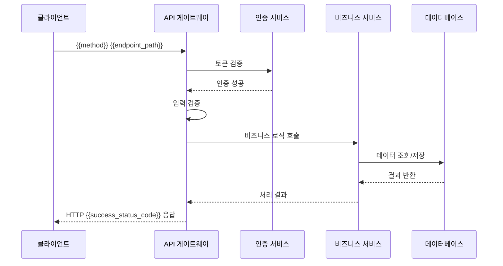
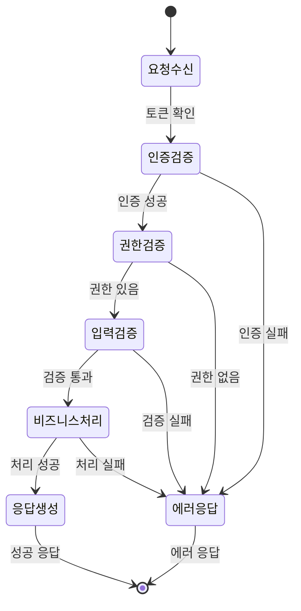

# {{endpoint_name}} API 엔드포인트

> [!abstract] 엔드포인트 개요
> **엔드포인트**: `{{method}} {{endpoint_path}}`
> **기능**: {{endpoint_description}}
> **담당**: {{assignee}}
> **상태**: {{status}}
> **버전**: {{version}}

---

## 🎯 엔드포인트 목적

{{endpoint_purpose}}

### 사용 사례
- {{use_case_1}}
- {{use_case_2}}
- {{use_case_3}}

---

## 📋 API 명세

### 요청 정보

**메서드**: `{{method}}`  
**엔드포인트**: `{{endpoint_path}}`  
**인증**: {{authentication_required}}  
**권한**: {{required_permissions}}

### 요청 헤더

| 헤더명 | 필수 | 설명 | 예시 |
|--------|------|------|------|
| `Authorization` | {{auth_required}} | Bearer 토큰 인증 | `Bearer eyJ0eXAi...` |
| `Content-Type` | {{content_type_required}} | 요청 본문 타입 | `application/json` |
| `X-API-Key` | {{api_key_required}} | API 키 | `sk-1234567890abcdef` |

### 요청 본문 ({{method}})

```json
{
  "{{field_1}}": "{{value_1}}",
  "{{field_2}}": {{value_2}},
  "{{field_3}}": {
    "{{nested_field_1}}": "{{nested_value_1}}",
    "{{nested_field_2}}": {{nested_value_2}}
  }
}
```

#### 필드 상세

| 필드명 | 타입 | 필수 | 설명 | 유효값 | 기본값 |
|--------|------|------|------|--------|--------|
| `{{field_1}}` | `{{type_1}}` | ✅ | {{description_1}} | {{valid_values_1}} | {{default_1}} |
| `{{field_2}}` | `{{type_2}}` | {{required_2}} | {{description_2}} | {{valid_values_2}} | {{default_2}} |
| `{{field_3}}` | `object` | {{required_3}} | {{description_3}} | - | - |

### 쿼리 파라미터

| 파라미터 | 타입 | 필수 | 설명 | 기본값 |
|----------|------|------|------|--------|
| `{{param_1}}` | `{{param_type_1}}` | {{param_required_1}} | {{param_description_1}} | {{param_default_1}} |
| `{{param_2}}` | `{{param_type_2}}` | {{param_required_2}} | {{param_description_2}} | {{param_default_2}} |

### 경로 파라미터

| 파라미터 | 타입 | 설명 | 예시 |
|----------|------|------|------|
| `{{path_param_1}}` | `{{path_type_1}}` | {{path_description_1}} | `{{path_example_1}}` |
| `{{path_param_2}}` | `{{path_type_2}}` | {{path_description_2}} | `{{path_example_2}}` |

---

## 📤 응답 명세

### 성공 응답 ({{success_status_code}})

```json
{
  "success": true,
  "data": {
    "{{response_field_1}}": "{{response_value_1}}",
    "{{response_field_2}}": {{response_value_2}},
    "{{response_field_3}}": {
      "{{nested_response_1}}": "{{nested_response_value_1}}",
      "{{nested_response_2}}": {{nested_response_value_2}}
    }
  },
  "metadata": {
    "timestamp": "2025-01-27T12:00:00Z",
    "request_id": "req-1234567890",
    "version": "{{version}}"
  }
}
```

#### 응답 필드 상세

| 필드명 | 타입 | 설명 | 예시 |
|--------|------|------|------|
| `success` | `boolean` | 요청 성공 여부 | `true` |
| `data` | `object` | 응답 데이터 | - |
| `data.{{response_field_1}}` | `{{response_type_1}}` | {{response_description_1}} | `{{response_example_1}}` |
| `metadata.timestamp` | `string` | 응답 생성 시간 (ISO 8601) | `"2025-01-27T12:00:00Z"` |
| `metadata.request_id` | `string` | 요청 추적 ID | `"req-1234567890"` |

### 에러 응답

#### 400 Bad Request
```json
{
  "success": false,
  "error": {
    "code": "VALIDATION_ERROR",
    "message": "요청 데이터가 유효하지 않습니다",
    "details": {
      "{{field_name}}": ["필수 필드입니다", "형식이 올바르지 않습니다"]
    }
  },
  "metadata": {
    "timestamp": "2025-01-27T12:00:00Z",
    "request_id": "req-1234567890"
  }
}
```

#### 401 Unauthorized
```json
{
  "success": false,
  "error": {
    "code": "AUTHENTICATION_ERROR",
    "message": "인증이 필요합니다"
  }
}
```

#### 403 Forbidden
```json
{
  "success": false,
  "error": {
    "code": "PERMISSION_DENIED",
    "message": "접근 권한이 없습니다"
  }
}
```

#### 404 Not Found
```json
{
  "success": false,
  "error": {
    "code": "RESOURCE_NOT_FOUND",
    "message": "요청한 리소스를 찾을 수 없습니다"
  }
}
```

#### 500 Internal Server Error
```json
{
  "success": false,
  "error": {
    "code": "INTERNAL_ERROR",
    "message": "서버 내부 오류가 발생했습니다"
  }
}
```

---

## 🔄 처리 흐름

### 시퀀스 다이어그램



### 상태 다이어그램



---

## 🧪 테스트 케이스

### 성공 케이스

#### 테스트 케이스 1: 기본 기능
```bash
curl -X {{method}} "{{base_url}}{{endpoint_path}}" \
  -H "Authorization: Bearer {token}" \
  -H "Content-Type: application/json" \
  -d '{
    "{{field_1}}": "{{test_value_1}}",
    "{{field_2}}": {{test_value_2}}
  }'
```

**기대 결과**: `{{success_status_code}}` 상태 코드와 성공 응답

#### 테스트 케이스 2: 경계값
```bash
# 최대값 테스트
curl -X {{method}} "{{base_url}}{{endpoint_path}}" \
  -H "Authorization: Bearer {token}" \
  -d '{{boundary_test_data}}'
```

### 실패 케이스

#### 테스트 케이스 3: 인증 실패
```bash
curl -X {{method}} "{{base_url}}{{endpoint_path}}" \
  -H "Authorization: Bearer invalid_token"
```

**기대 결과**: `401 Unauthorized`

#### 테스트 케이스 4: 유효성 검증 실패
```bash
curl -X {{method}} "{{base_url}}{{endpoint_path}}" \
  -H "Authorization: Bearer {token}" \
  -d '{{invalid_data}}'
```

**기대 결과**: `400 Bad Request`

#### 테스트 케이스 5: 권한 부족
```bash
curl -X {{method}} "{{base_url}}{{endpoint_path}}" \
  -H "Authorization: Bearer {insufficient_token}"
```

**기대 결과**: `403 Forbidden`

---

## 📊 성능 요구사항

### 응답 시간
- **평균**: {{avg_response_time}}ms 이하
- **95번째 백분위수**: {{p95_response_time}}ms 이하
- **최대**: {{max_response_time}}ms 이하

### 처리량
- **RPS (초당 요청 수)**: {{rps_target}} 이상
- **동시 사용자**: {{concurrent_users}}명 지원

### 가용성
- **SLA**: {{sla_percentage}}% uptime
- **MTTR (평균 복구 시간)**: {{mttr_minutes}}분 이하

---

## 🔒 보안 고려사항

### 인증 요구사항
- **JWT 토큰**: RS256 알고리즘 사용
- **토큰 만료**: {{token_expiry}}시간
- **리프레시 토큰**: 지원 {{refresh_token_support}}

### 권한 모델
- **RBAC (역할 기반 접근 제어)**: {{rbac_enabled}}
- **필요한 역할**: `{{required_role}}`
- **추가 권한**: {{additional_permissions}}

### 데이터 보호
- **민감 데이터**: {{sensitive_data_handling}}
- **암호화**: {{encryption_required}}
- **로깅**: {{audit_logging}}

---

## 📈 모니터링

### 메트릭 수집

| 메트릭 | 설명 | 임계값 | 알림 |
|--------|------|--------|------|
| `api_{{endpoint_name}}_requests_total` | 총 요청 수 | - | - |
| `api_{{endpoint_name}}_requests_duration` | 응답 시간 | {{alert_threshold}}ms | ✅ |
| `api_{{endpoint_name}}_errors_total` | 에러 수 | {{error_threshold}} | ✅ |

### 로그 레벨

```json
{
  "level": "{{log_level}}",
  "message": "{{endpoint_name}} request processed",
  "request_id": "req-1234567890",
  "method": "{{method}}",
  "path": "{{endpoint_path}}",
  "status_code": {{status_code}},
  "duration_ms": {{duration}},
  "user_id": "{{user_id}}"
}
```

---

## 🚀 배포 노트

### 버전별 변경사항

#### v{{version}}
- **기능 추가**: {{new_feature}}
- **호환성**: {{breaking_changes}}
- **마이그레이션**: {{migration_guide}}

### 롤백 계획
1. 트래픽을 이전 버전으로 라우팅
2. 데이터베이스 롤백 (필요시)
3. 캐시 무효화
4. 모니터링 확인

---

## 📚 관련 문서

- [API 개요](./api_overview.md)
- [인증 가이드](./authentication_guide.md)
- [에러 코드 참조](./error_codes.md)
- [통합 테스트](./integration_tests.md)

---

## 🏷️ 태그 및 메타데이터

**태그**: #{{endpoint_name}} #api #{{method}} #{{status}} #{{version}}

**카테고리**: API 엔드포인트

**관련 엔드포인트**:
- `GET {{related_endpoint_1}}`
- `POST {{related_endpoint_2}}`

---

> [!info] 문서 정보
> **템플릿 버전**: 1.0.0
> **마지막 수정**: {{date:YYYY-MM-DD}}
> **담당자**: {{assignee}}
> **API 버전**: {{version}}

---

> [!tip] 빠른 테스트
> ```bash
> # 성공 케이스 테스트
> curl -X {{method}} "{{base_url}}{{endpoint_path}}" \
>   -H "Authorization: Bearer YOUR_TOKEN" \
>   -H "Content-Type: application/json" \
>   -d '{{sample_request}}'
