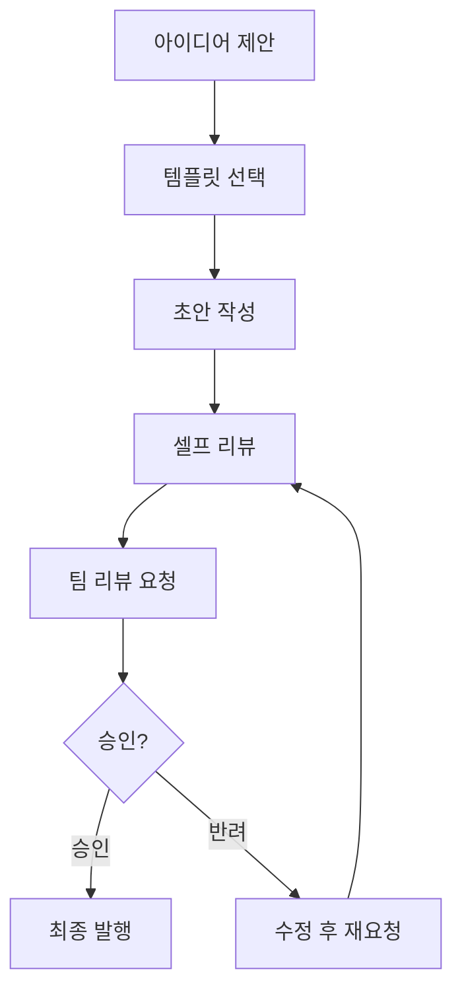
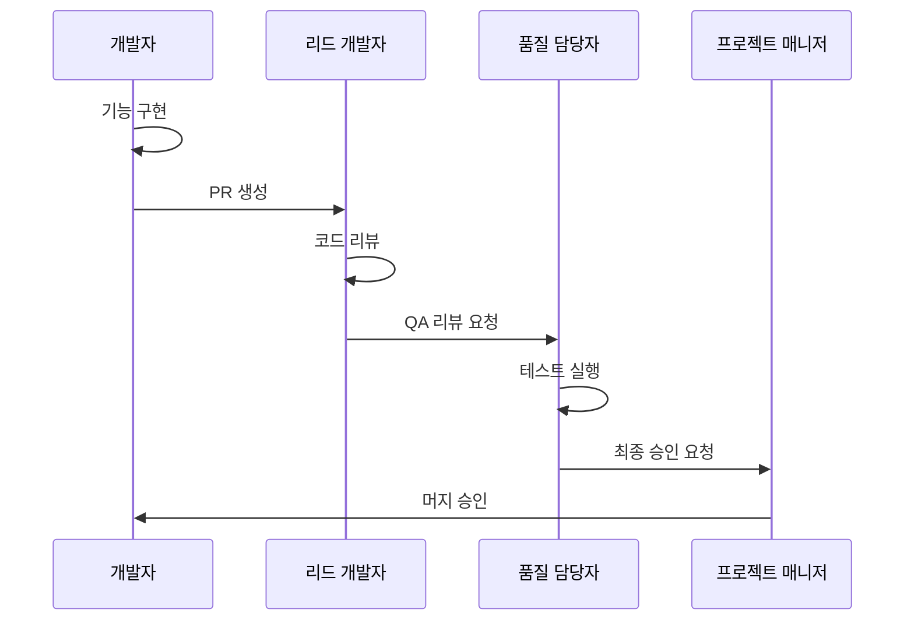
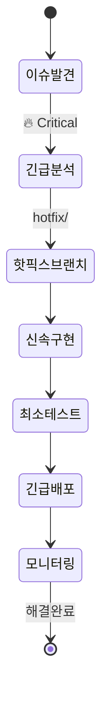
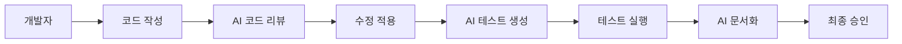

# 옵시디언 협업 워크플로우 가이드

> [!abstract] 협업 개요
> AFO Kingdom의 옵시디언 기반 협업 시스템입니다.
> Trinity 철학을 기반으로 한 효율적인 팀 협업을 지원합니다.

---

## 👥 협업 기능 구성

### 1. 실시간 협업 설정

#### 옵시디언 Sync 설정
```yaml
# .obsidian/config 파일
{
  "sync": {
    "enabled": true,
    "remoteVault": "afo-kingdom-docs",
    "syncOnSave": true,
    "conflictResolution": "manual"
  }
}
```

#### Git 기반 협업
```bash
# 저장소 설정
git remote add origin https://github.com/lofibrainwav/AFO_Kingdom.git
git branch -M main
git push -u origin main

# 브랜치 전략
git checkout -b feature/{{feature_name}}
git checkout -b hotfix/{{issue_number}}
```

### 2. 역할 기반 권한 관리

#### 팀 역할 정의
| 역할 | 권한 | 담당 영역 |
|------|------|----------|
| 👑 **사령관** | 전체 관리 | 전략 방향성, 최종 승인 |
| ⚔️ **제갈량** | 기술 리드 | 아키텍처 설계, 코드 품질 |
| 🛡️ **사마의** | 품질 게이트 | 보안, 테스팅, 리스크 관리 |
| 🌉 **주유** | UX/서사 | 사용자 경험, 문서화 |

#### 문서 권한 매트릭스
```dataview
TABLE
	file.path as "문서",
	owner as "소유자",
	reviewers as "리뷰어",
	editors as "편집자"
FROM "docs"
WHERE owner AND reviewers
SORT owner ASC
```

---

## 🔄 협업 워크플로우

### 문서 생성 워크플로우



### 코드 리뷰 워크플로우



### 긴급 패치 워크플로우



---

## 📋 협업 템플릿

### PR 템플릿

#### `.github/PULL_REQUEST_TEMPLATE.md`
```markdown
## 🎯 변경 사항

### 변경 유형
- [ ] 🐛 버그 수정
- [ ] ✨ 새로운 기능
- [ ] 💥 Breaking change
- [ ] 📚 문서 업데이트
- [ ] 🎨 코드 스타일 변경
- [ ] ⚡ 성능 개선
- [ ] 🔧 리팩토링

### 변경 설명
{{변경사항_설명}}

## 🔍 검토 포인트

### Trinity Score 평가
- **眞 (Truth)**: {{기술적_정확성}}
- **善 (Goodness)**: {{안정성_확보}}
- **美 (Beauty)**: {{사용성_개선}}
- **孝 (Serenity)**: {{운영_편의성}}
- **永 (Eternity)**: {{유지보수성}}

### 테스트 결과
- [ ] 단위 테스트 통과
- [ ] 통합 테스트 통과
- [ ] E2E 테스트 통과
- [ ] 성능 테스트 통과

### 문서화
- [ ] 코드 주석 업데이트
- [ ] API 문서 업데이트
- [ ] 사용자 가이드 업데이트

## 🚀 배포 영향

### 영향 범위
- [ ] Frontend 변경
- [ ] Backend 변경
- [ ] Database 변경
- [ ] Infrastructure 변경

### 롤백 계획
{{롤백_계획}}

## 📊 메트릭

### 성능 영향
- 응답 시간: {{응답시간_변화}}
- 메모리 사용: {{메모리_변화}}
- CPU 사용: {{cpu_변화}}

### 사용자 영향
- 영향 사용자 수: {{영향_사용자_수}}
- 다운타임 필요: {{다운타임_필요_여부}}

---

**체크리스트 완료**: {{체크리스트_완료율}}%
**리뷰어**: @{{리뷰어}}
**테스터**: @{{테스터}}
```

### 코드 리뷰 체크리스트

#### `CODE_REVIEW_CHECKLIST.md`
```markdown
# 코드 리뷰 체크리스트

## 🔍 기능 검증
- [ ] 요구사항 충족 확인
- [ ] 엣지 케이스 처리 확인
- [ ] 에러 처리 로직 검증

## 🏗️ 아키텍처 검토
- [ ] 설계 패턴 준수
- [ ] SOLID 원칙 준수
- [ ] 의존성 주입 적절성

## 🔒 보안 검토
- [ ] 입력 검증 구현
- [ ] SQL 인젝션 방지
- [ ] XSS/CSRF 방지
- [ ] 민감 데이터 처리

## ⚡ 성능 검토
- [ ] N+1 쿼리 방지
- [ ] 메모리 누수 방지
- [ ] 캐싱 전략 적절성

## 🧪 테스트 검토
- [ ] 단위 테스트 작성
- [ ] 테스트 커버리지 80% 이상
- [ ] 통합 테스트 포함

## 📚 문서화
- [ ] 코드 주석 완성
- [ ] API 문서 업데이트
- [ ] README 업데이트

## 🎯 코드 품질
- [ ] 린팅 규칙 준수
- [ ] 타입 힌트 사용
- [ ] 네이밍 컨벤션 준수

---
**리뷰어**: {{reviewer_name}}
**리뷰 일자**: {{review_date}}
**승인 상태**: ⏳ 대기 / ✅ 승인 / ❌ 반려
```

---

## 👥 팀 관리 기능

### 팀 구성원 관리

```dataview
TABLE
	role as "역할",
	skills as "전문 분야",
	projects as "담당 프로젝트",
	status as "상태"
FROM "team"
WHERE status = "active"
SORT role ASC
```

### 업무 분담 현황

```dataview
TABLE
	assignee as "담당자",
	count as "할당 태스크 수",
	avg_complexity as "평균 난이도",
	completion_rate as "완료율"
FROM "docs"
WHERE type = "task" AND assignee
FLATTEN assignee as assignee
GROUP BY assignee
SORT count DESC
```

### 스프린트 진행 상황

```dataview
TABLE WITHOUT ID
	sum(rows.where(meta(status) = "completed").file.size) as "완료된 작업량",
	sum(rows.where(meta(status) = "in-progress").file.size) as "진행중 작업량",
	sum(rows.where(meta(status) = "pending").file.size) as "대기 작업량"
FROM "docs"
WHERE sprint = "{{current_sprint}}"
GROUP BY true
```

---

## 📊 협업 메트릭

### 팀 생산성 메트릭

```dataviewjs
const tasks = dv.pages('"docs"').where(p => p.type === "task");
const completedTasks = tasks.where(p => p.status === "completed");
const inProgressTasks = tasks.where(p => p.status === "in-progress");

const completionRate = (completedTasks.length / tasks.length) * 100;
const avgComplexity = tasks.avg(p => p.complexity || 0);

dv.paragraph(`## 📈 팀 생산성 현황

- **총 태스크**: ${tasks.length}개
- **완료율**: ${completionRate.toFixed(1)}%
- **진행중**: ${inProgressTasks.length}개
- **평균 난이도**: ${avgComplexity.toFixed(1)}점
- **번다운 차트**: [[burndown-chart-${dv.current().sprint || 'current'}]]
`);
```

### 코드 품질 메트릭

```dataviewjs
const prs = dv.pages('"docs"').where(p => p.type === "pull-request");
const approvedPRs = prs.where(p => p.status === "approved");
const rejectedPRs = prs.where(p => p.status === "rejected");

const approvalRate = (approvedPRs.length / prs.length) * 100;
const avgReviewTime = prs.avg(p => p.review_time_hours || 0);

dv.paragraph(`## 🔍 코드 품질 현황

- **총 PR**: ${prs.length}개
- **승인율**: ${approvalRate.toFixed(1)}%
- **평균 리뷰 시간**: ${avgReviewTime.toFixed(1)}시간
- **품질 게이트 통과율**: [[quality-gate-chart-${dv.current().month || 'current'}]]
`);
```

---

## 🎯 협업 모범 사례

### 1. 브랜치 전략

#### Git Flow 브랜치 전략
```
main (production-ready)
├── develop (통합 브랜치)
│   ├── feature/ (기능 개발)
│   │   ├── feature/user-auth
│   │   └── feature/payment-system
│   ├── release/ (릴리즈 준비)
│   │   └── release/v1.2.0
│   └── hotfix/ (긴급 수정)
│       └── hotfix/security-patch
```

#### 브랜치 네이밍 컨벤션
```bash
# 기능 개발
git checkout -b feature/feat-user-profile

# 버그 수정
git checkout -b bugfix/fix-login-validation

# 긴급 패치
git checkout -b hotfix/critical-security-issue

# 문서화
git checkout -b docs/update-api-documentation
```

### 2. 커밋 메시지 표준

#### 커밋 메시지 포맷
```
<type>(<scope>): <subject>

<body>

<footer>
```

#### 타입별 예시
```bash
# 기능 추가
feat(auth): add OAuth2 login support

# 버그 수정
fix(api): resolve null pointer exception in user service

# 문서화
docs(readme): update installation instructions

# 리팩토링
refactor(db): optimize query performance in user repository

# 테스트
test(auth): add unit tests for JWT token validation
```

### 3. 코드 리뷰 가이드라인

#### 리뷰어의 역할
- **기술적 정확성 검증**: 코드가 요구사항을 충족하는지 확인
- **코드 품질 향상**: 가독성, 유지보수성, 성능 개선 제안
- **지식 공유**: 모범 사례 전파 및 학습 기회 제공

#### 리뷰이의 역할
- **명확한 의도 설명**: 변경사항의 목적과 영향을 설명
- **개방적 태도**: 건설적 피드백을 성장 기회로 받아들임
- **즉각적 조치**: 피드백 반영 및 재리뷰 요청

---

## 🔧 협업 도구 설정

### 옵시디언 협업 플러그인

#### 필수 플러그인
```json
{
  "plugins": {
    "dataview": true,
    "kanban": true,
    "calendar": true,
    "advanced-tables": true,
    "mermaid-tools": true
  }
}
```

#### 추천 플러그인
```json
{
  "plugins": {
    "projects": true,
    "review": true,
    "version-history": true,
    "conflict-resolution": true
  }
}
```

### Git 설정

#### 글로벌 Git 설정
```bash
# 사용자 정보 설정
git config --global user.name "Your Name"
git config --global user.email "your.email@company.com"

# 기본 브랜치 설정
git config --global init.defaultBranch main

# 자동 stash 설정
git config --global rebase.autoStash true
```

#### 프로젝트별 Git 설정
```bash
# .git/config
[core]
    autocrlf = input
[merge]
    conflictstyle = diff3
[diff]
    colorMoved = default
```

---

## 📈 협업 성과 측정

### KPI 대시보드

```dataviewjs
const kpis = {
  velocity: 85, // 스토리 포인트/스프린트
  quality: 92,  // 버그 재발율 (%)
  satisfaction: 88, // 팀 만족도 (%)
  delivery: 95   // 약속된 일정 준수율 (%)
};

const kpiItems = Object.entries(kpis).map(([key, value]) => {
  const status = value >= 90 ? '🟢' : value >= 80 ? '🟡' : '🔴';
  return `${status} ${key}: ${value}%`;
}).join('\n');

dv.paragraph(`## 📊 협업 KPI 현황

${kpiItems}

**종합 점수**: ${Math.round(Object.values(kpis).reduce((a, b) => a + b, 0) / Object.keys(kpis).length)}%
`);
```

### 개선 영역 식별

```dataviewjs
const issues = dv.pages('"docs"').where(p => p.type === "issue" && p.category === "collaboration");

const categories = {};
issues.forEach(issue => {
  const category = issue.category || '기타';
  categories[category] = (categories[category] || 0) + 1;
});

const topIssues = Object.entries(categories)
  .sort(([,a], [,b]) => b - a)
  .slice(0, 5)
  .map(([category, count]) => `- ${category}: ${count}건`)
  .join('\n');

dv.paragraph(`## 🎯 개선 우선순위

${topIssues}

**총 이슈**: ${issues.length}건
**해결율**: ${Math.round(issues.where(p => p.status === "resolved").length / issues.length * 100)}%
`);
```

---

## 🚀 고급 협업 패턴

### 1. 문서 기반 개발 (Documentation-Driven Development)

#### 프로세스
1. **요구사항 문서화**: 옵시디언으로 상세 요구사항 작성
2. **디자인 문서화**: API 설계 및 아키텍처 다이어그램 작성
3. **코드 구현**: 문서를 기반으로 코드 작성
4. **테스트 문서화**: 테스트 케이스 및 결과 기록
5. **배포 문서화**: 배포 계획 및 롤백 전략 작성

#### 장점
- **일관성 확보**: 모든 이해관계자의 요구사항 일치
- **지식 축적**: 재사용 가능한 문서와 패턴 구축
- **품질 향상**: 사전 검토를 통한 결함 예방

### 2. 모바일 퍼스트 협업

#### 모바일 최적화 설정
```yaml
# .obsidian/config
mobile:
  enabled: true
  sync: true
  offline_editing: true
  conflict_resolution: "last-writer-wins"
```

#### 모바일 협업 워크플로우
- **필드 작업**: 옵시디언 모바일로 현장 노트 작성
- **즉시 동기화**: 변경사항 실시간 반영
- **오프라인 작업**: 네트워크 불안정시에도 작업 가능
- **자동 백업**: 변경사항 클라우드 자동 저장

### 3. AI 지원 협업

#### AI 도구 활용
- **코드 리뷰 자동화**: GitHub Copilot, CodeRabbit
- **문서 자동 생성**: GitHub Copilot for Docs
- **테스트 자동 생성**: 테스트 케이스 자동 작성
- **번역 및 현지화**: 다국어 문서 자동 번역

#### AI 협업 워크플로우


---

> [!tip] 협업 성공 팁
>
> 1. **명확한 역할 분담**: 각 팀원의 강점을 살린 업무 배분
> 2. **정기적 커뮤니케이션**: 스탠드업 미팅 및 진행 상황 공유
> 3. **지식 공유 문화**: 코드 리뷰와 문서화를 통한 학습
> 4. **자동화 우선**: 반복 작업은 스크립트와 템플릿으로 자동화
> 5. **품질 게이트**: 모든 변경사항에 대한 검토 프로세스 준수

---

> [!info] 협업 메타데이터
> **템플릿 버전**: 1.0.0
> **마지막 수정**: {{date:YYYY-MM-DD}}
> **적용 범위**: 팀 협업 워크플로우
> **다음 업데이트**: {{next_review_date}}
