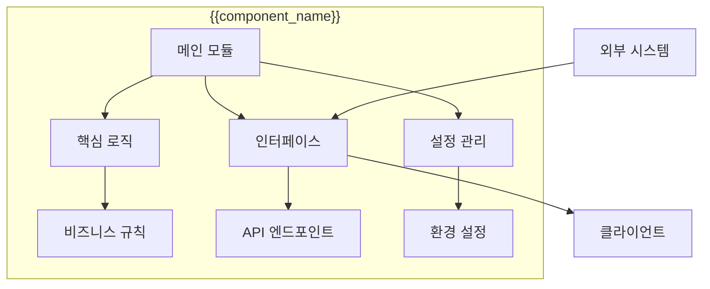
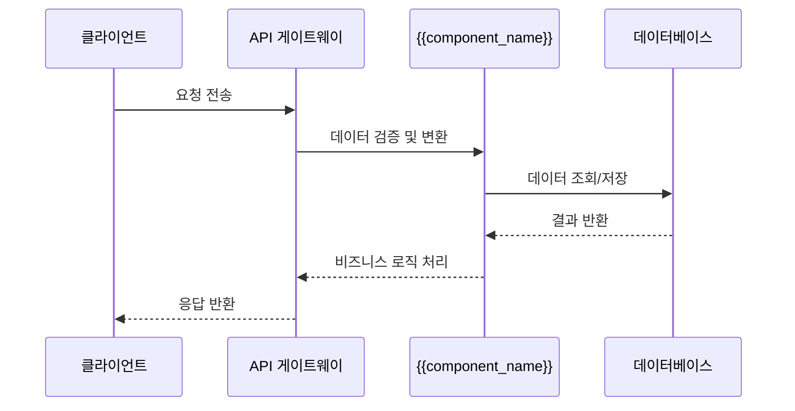
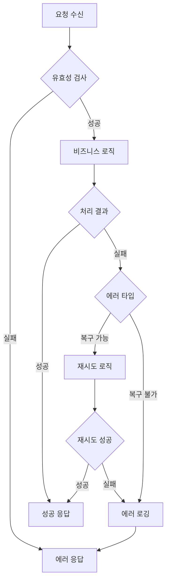

# {{component_name}} 시스템 컴포넌트

> [!abstract] 컴포넌트 개요
> **컴포넌트명**: {{component_name}}
> **타입**: {{component_type}}
> **담당**: {{assignee}}
> **상태**: {{status}}
> **버전**: {{version}}

---

## 🎯 컴포넌트 목적

{{component_purpose}}

### 주요 기능
- {{feature_1}}
- {{feature_2}}
- {{feature_3}}

---

## 🏗️ 아키텍처 설계

### 컴포넌트 구조도



### 인터페이스 설계

#### 입력 인터페이스
```python
# {{component_name}} 입력 인터페이스
@dataclass
class {{component_name}}Input:
    {{input_field_1}}: {{input_type_1}}
    {{input_field_2}}: {{input_type_2}}
    {{input_field_3}}: {{input_type_3}}
```

#### 출력 인터페이스
```python
# {{component_name}} 출력 인터페이스
@dataclass
class {{component_name}}Output:
    {{output_field_1}}: {{output_type_1}}
    {{output_field_2}}: {{output_type_2}}
    success: bool
    error_message: Optional[str]
```

---

## 📊 데이터 모델

### 핵심 엔티티

| 엔티티 | 설명 | 주요 속성 |
|--------|------|----------|
| {{entity_1}} | {{entity_1_description}} | {{entity_1_properties}} |
| {{entity_2}} | {{entity_2_description}} | {{entity_2_properties}} |

### 데이터베이스 스키마

```sql
-- {{component_name}} 관련 테이블
CREATE TABLE {{table_name}} (
    id SERIAL PRIMARY KEY,
    {{column_1}} {{type_1}} NOT NULL,
    {{column_2}} {{type_2}},
    created_at TIMESTAMP DEFAULT NOW(),
    updated_at TIMESTAMP DEFAULT NOW()
);

-- 인덱스
CREATE INDEX idx_{{table_name}}_{{column_1}} ON {{table_name}}({{column_1}});
```

---

## 🔄 처리 흐름

### 메인 프로세스



### 에러 처리 흐름



---

## ⚙️ 설정 및 환경 변수

### 필수 환경 변수

| 변수명 | 설명 | 기본값 | 필수 |
|--------|------|--------|------|
| `{{ENV_VAR_1}}` | {{env_var_1_description}} | {{default_1}} | ✅ |
| `{{ENV_VAR_2}}` | {{env_var_2_description}} | {{default_2}} | ❌ |

### 설정 파일 구조

```yaml
# {{component_name}} 설정
{{component_name_lower}}:
  host: "{{host}}"
  port: {{port}}
  database_url: "{{database_url}}"
  log_level: "{{log_level}}"
  features:
    {{feature_1}}: {{feature_1_enabled}}
    {{feature_2}}: {{feature_2_enabled}}
```

---

## 🧪 테스트 전략

### 단위 테스트

```python
# tests/test_{{component_name_lower}}.py
import pytest
from {{module_path}} import {{component_name}}

class Test{{component_name}}:
    def test_success_case(self):
        # Given
        input_data = {{test_input}}

        # When
        result = {{component_name}}.process(input_data)

        # Then
        assert result.success == True
        assert result.{{output_field}} == {{expected_value}}

    def test_error_case(self):
        # Given
        invalid_input = {{invalid_input}}

        # When & Then
        with pytest.raises({{expected_exception}}):
            {{component_name}}.process(invalid_input)
```

### 통합 테스트

```python
# tests/test_{{component_name_lower}}_integration.py
import pytest
from fastapi.testclient import TestClient
from {{app_module}} import app

@pytest.fixture
def client():
    return TestClient(app)

def test_api_endpoint(client):
    # API 엔드포인트 테스트
    response = client.post("/api/{{endpoint}}", json={{test_data}})
    assert response.status_code == 200
    assert response.json() == {{expected_response}}
```

---

## 📈 모니터링 및 로깅

### 메트릭 수집

| 메트릭 | 설명 | 임계값 |
|--------|------|--------|
| `{{metric_1}}` | {{metric_1_description}} | {{threshold_1}} |
| `{{metric_2}}` | {{metric_2_description}} | {{threshold_2}} |

### 로그 레벨 설정

```python
import logging

# 로거 설정
logger = logging.getLogger("{{component_name_lower}}")
logger.setLevel(logging.{{log_level}})

# 핸들러 설정
handler = logging.StreamHandler()
formatter = logging.Formatter(
    '%(asctime)s - %(name)s - %(levelname)s - %(message)s'
)
handler.setFormatter(formatter)
logger.addHandler(handler)
```

---

## 🔒 보안 고려사항

### 인증 및 권한

- **API 키 인증**: 외부 서비스 접근용
- **JWT 토큰**: 사용자 세션 관리
- **역할 기반 접근 제어**: RBAC 구현

### 데이터 보호

- **암호화**: 민감 데이터 암호화 저장
- **입력 검증**: SQL 인젝션 및 XSS 방지
- **속도 제한**: Rate limiting 적용

---

## 🚀 배포 및 운영

### Docker 구성

```dockerfile
# Dockerfile
FROM python:3.12-slim

WORKDIR /app

COPY requirements.txt .
RUN pip install -r requirements.txt

COPY . .

EXPOSE {{port}}

CMD ["python", "{{main_script}}.py"]
```

### 헬스 체크 엔드포인트

```python
# health.py
from fastapi import APIRouter

router = APIRouter()

@router.get("/health")
async def health_check():
    return {
        "status": "healthy",
        "component": "{{component_name}}",
        "version": "{{version}}",
        "timestamp": "2025-01-27T12:00:00Z"
    }
```

---

## 📚 관련 문서

- [API 문서](./api/{{component_name_lower}}_api.md)
- [배포 가이드](./deployment/{{component_name_lower}}_deployment.md)
- [문제 해결 가이드](./troubleshooting/{{component_name_lower}}_issues.md)

---

## 🏷️ 태그 및 메타데이터

**태그**: #{{component_name}} #{{component_type}} #{{status}} #system-component

**카테고리**: 시스템 컴포넌트

**관련 컴포넌트**:
- {{related_component_1}}
- {{related_component_2}}

---

> [!info] 문서 정보
> **템플릿 버전**: 1.0.0
> **마지막 수정**: {{date:YYYY-MM-DD}}
> **담당자**: {{assignee}}
> **컴포넌트 버전**: {{version}}
