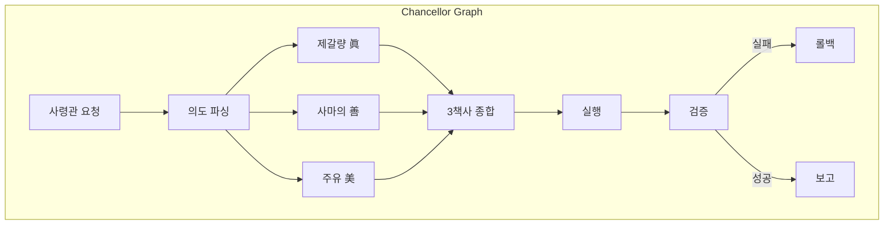

# 🏰 AFO Kingdom 확장 로드맵 (Phase 21)

> **Stage 1~4 SSOT 산출물** | 작성일: 2025-12-27

---

## 📋 개요

| Stage | 목적 | 핵심 산출물 |
|-------|------|------------|
| **1** | 빠른 검증 | 실험 템플릿 + 폐기 기준 |
| **2** | 프로덕션 준비 | Allowlist + Fallback 규칙 |
| **3** | 고도화 | Chancellor Graph 확장 가이드 |
| **4** | 스케일링 | 가시성 유지 체크리스트 |

---

## Stage 1: 빠른 검증 (Prototyping)

### 목적
새 에이전트/워크플로우를 20분짜리 프로토로 빠르게 실험

### 왕국 적용
- Skills Registry에 **실험용 스킬**로 임시 등록
- 결과 로그만 남기고 폐기 가능

### 산출물 템플릿

```markdown
# EXP_XXX_[실험명]

## 목적
[1줄 설명]

## 가설
[검증하려는 것]

## 실행
[커맨드 또는 스텝]

## 결과
- [ ] 성공 → Stage 2 승격
- [ ] 실패 → 폐기 사유:

## 폐기 기준
- 72시간 내 Stage 2 미승격 시 자동 아카이브
```

### 현재 실험 목록
- `EXP_001_royal_governance_verification.md`
- `EXP_002_ui_api_consistency_verification.md`
- `EXP_005_monitoring_alarms_verification.md`
- `EXP_007_deploy_rollback_test.md`

---

## Stage 2: 프로덕션 준비 (Guardrails & Hosted Tools)

### 목적
툴/메모리/가드레일을 운영 가능한 형태로 정리

### 왕국 적용

#### Skills Allowlist (승인된 스킬만 호출)

```yaml
# skills_allowlist.yaml
approved_skills:
  - skill_001_brave_search
  - skill_003_filesystem_read
  - skill_005_memory_kv
  - skill_041_royal_library

blocked_skills:
  - skill_999_experimental  # Stage 1에서 미승격

fallback_rules:
  - if: skill_unavailable
    then: log_and_skip
  - if: rate_limit_exceeded
    then: exponential_backoff
```

#### API Wallet 강화
- Rate Limit: Redis-backed 분산 제한
- Secret Rotation: Vault Manager 연동
- Audit Trail: PostgreSQL 기록

---

## Stage 3: 고도화 (Graph-based Orchestration)

### 목적
에이전트 군단을 Chancellor Graph로 조율

### 왕국 적용
기존 Chancellor Graph를 노드/엣지 기준으로 확장



### 확장 규칙
1. **Checkpoint**: 각 노드 완료 후 상태 저장
2. **Retry**: 실패 시 최대 3회 재시도
3. **Rollback**: VERIFY 실패 시 이전 상태로 복원

---

## Stage 4: 스케일링 (Observability & Automation)

### 목적
배포/관찰/테스트를 자동화해서 운영 피로 감소

### 가시성 유지 체크리스트

| 항목 | 도구 | 목표 |
|------|------|------|
| **로그** | SSE Stream | 실시간 Chancellor 이벤트 |
| **메트릭** | Prometheus + Grafana | Trinity Score 대시보드 |
| **알림** | AlertManager | Trinity < 0.7 시 알림 |
| **추적** | Trace ID | 요청별 전체 흐름 추적 |

### 자동화 파이프라인

```
Backup → Check → Execute → Verify → Report
   ↓        ↓        ↓         ↓        ↓
  永       眞       美        善       孝
```

---

## ✅ 통합 Trinity 점검

| 기둥 | Stage 1 | Stage 2 | Stage 3 | Stage 4 |
|------|---------|---------|---------|---------|
| 眞 (Truth) | 가설 검증 | Allowlist | Checkpoint | Metrics |
| 善 (Goodness) | 폐기 기준 | Fallback | Rollback | Alerts |
| 美 (Beauty) | 간결한 템플릿 | 깔끔한 규칙 | 시각화 | Dashboard |
| 孝 (Serenity) | 빠른 실험 | 안정 운영 | 자동 조율 | 무마찰 |
| 永 (Eternity) | 아카이브 | 감사 로그 | 상태 저장 | 레거시 유지 |

---

## 📌 다음 단계

1. **Stage 1 실험 리뷰**: 72시간 초과 실험 정리
2. **Stage 2 Allowlist**: `skills_allowlist.yaml` 파일 생성
3. **Stage 3 Graph**: Chancellor Graph 노드 문서화
4. **Stage 4 Alert**: Trinity Alert 규칙 추가
