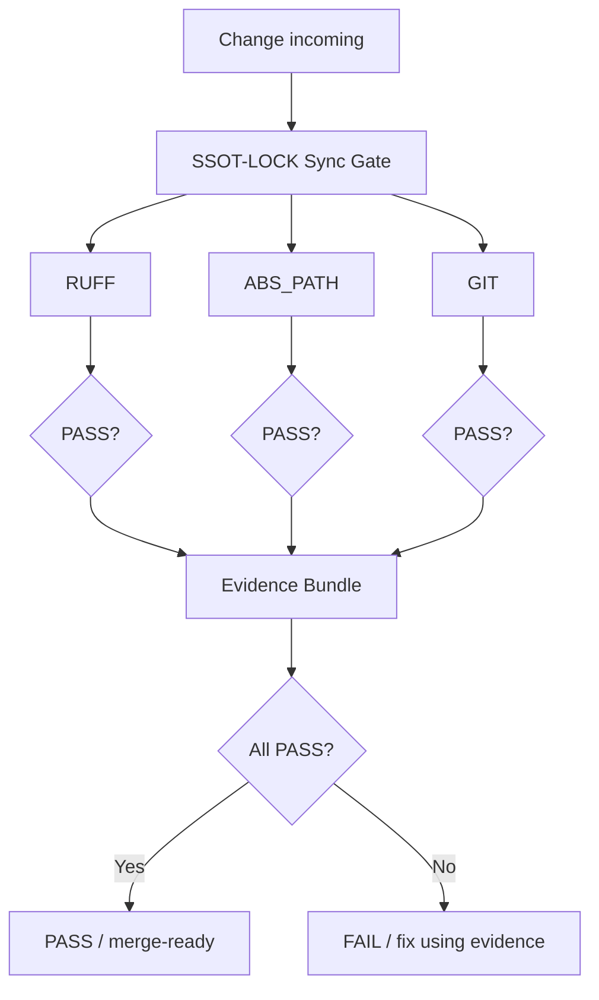

# SSOT-LOCK Sync Gate

## 목적
코드 변경이 들어오기 전에 3가지 게이트를 통과해야만 "SSOT-LOCK(단일 진실)"이 유지됩니다.

- RUFF: 코드 품질(린트) 게이트
- ABS_PATH: 절대경로 하드코딩 금지 게이트
- GIT: 작업트리 정합(unstaged/staged/untracked/ahead) 게이트

## 운영 원칙
- Fail-closed: 하나라도 FAIL이면 전체 FAIL
- Evidence-first: PASS/FAIL과 무관하게 증거 번들을 생성
- Sejong output: 다음 행동을 최대 3개만 제시

## 실행
```bash
./scripts/ssot_lock_sync_gate.sh
```

## 결과 해석

* PASS: 3게이트 모두 통과, 증거 번들 생성됨
* FAIL: "문제가 존재한다"는 뜻이 아니라, "문제를 정확히 잡았다"는 뜻입니다. 증거 번들을 보고 고치면 됩니다.

## 증거 번들

* 경로: docs/ssot/evidence/SSOT_LOCK_SYNC_GATE_YYYYMMDD_HHMMSS/
* 핵심 파일:

  * summary.txt
  * ruff_check.out.txt / ruff_check.err.txt
  * abs_path_hits.out.txt
  * git_status_sb.out.txt
  * git_diff_unstaged.out.txt
  * git_untracked_bad.txt

## untracked 격리(선택)

"나쁜 untracked만" 허용리스트로 격리하고 싶으면:

```bash
SSOT_APPLY_UNTRACKED_ALLOWLIST=true ./scripts/ssot_lock_sync_gate.sh
```

## 다이어그램



