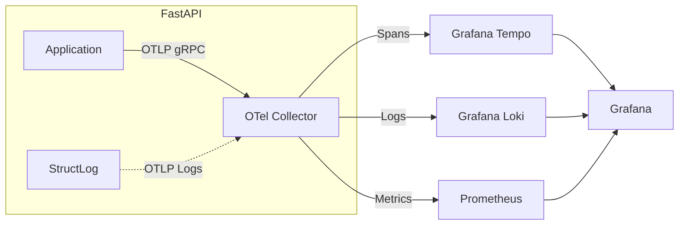

# PH-OBS-01: Observability Trinity (Trace·Log·Metric) Integration

## 🎯 Objective
Establish the **Holy Trinity of Observability** (Logs, Metrics, Traces) for the AFO Kingdom using the modern **Grafana Stack** (Loki, Prometheus, Tempo). This ensures "Conscience" (Self-Awareness) as envisioned in the 2025 Roadmap.

## 🏗️ Architecture (2025 Best Practices)

We will use a **Unified OpenTelemetry Collector** architecture to ensure future-proofing (永) and minimal component sprawl (美).

## 📋 Tasks

### 1. Infrastructure (Docker Compose)
- [ ] Add `grafana/tempo`, `grafana/loki`, `otel/opentelemetry-collector-contrib`.
- [ ] Configure `tempo.yaml` (S3/Local storage).
- [ ] Configure `loki-config.yaml` (Structured metadata active).
- [ ] Configure `otel-collector-config.yaml` (Pipelines for Traces, Metrics, Logs).

### 2. Application Layer (FastAPI)
- [ ] Install `opentelemetry-distro`, `opentelemetry-exporter-otlp`.
- [ ] Instrument `api_server.py` with `FastAPIInstrumentor`.
- [ ] Configure `structlog` to emit OTLP logs or JSON logs for Collector pickup.
    - *Decision*: Direct OTLP Logging is cleaner for Python in 2025 than file tailing.

### 3. Visualization (Grafana)
- [ ] Provision Data Sources (Tempo, Loki, Prometheus).
- [ ] Link TraceID between Loki Logs and Tempo Traces.
- [ ] Create "Trinity Dashboard" (Unified View).

## 🛡️ Success Criteria (Verification)
- **Trace-Log Correlation**: Can click a TraceID in a Log and jump to Tempo.
- **Metric-Trace Correlation**: Can see Latency Spike in Prometheus and jump to Exemplar Trace.
- **Zero-Cost**: Using local/minio storage initially (no paid SaaS).
- **SSOT Compliance**: All configured via code/docker-compose.

## 📚 References
- Grafana Tempo 2025 Docs (Metrics Generator)
- OpenTelemetry Python "Logs" SDK (Experimental -> Stable in 2025)
